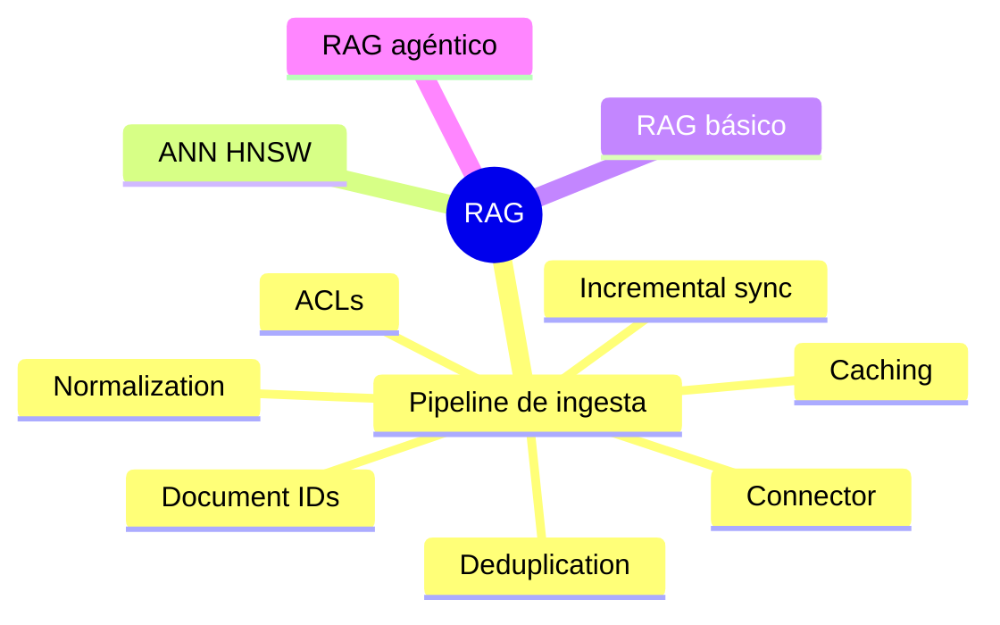

# RAG

> **En una frase:** todo lo que hace falta para que un LLM responda con tus datos: cómo entran (pipeline de ingesta), cómo se buscan rápido (ANN) y cómo se usan al generar (RAG básico y agéntico).

## Mapa


## Orden sugerido
1. [[Vector DB]] · el pipeline de ingesta y sus 7 preguntas
2. [[ANN HNSW]] · cómo escala la búsqueda
3. [[RAG básico]] · una búsqueda, una respuesta
4. [[RAG agéntico]] · el agente decide cuánto buscar

## Estado de los nodos
```dataview
TABLE WITHOUT ID file.link AS nodo, parent, estado
FROM "rag" WHERE tipo != "mapa" SORT parent, file.name
```

[[RAG.canvas|Abrir el canvas de RAG]] · para ver solo este subgrafo: clic derecho en esta nota → *Open local graph*.
