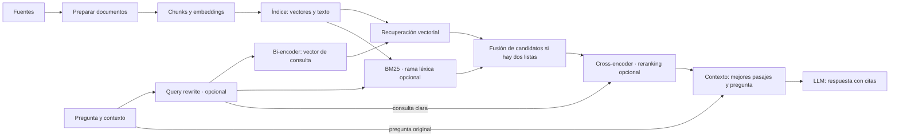

# RAG

> **En una frase:** preparar las fuentes, recuperar evidencia autorizada y usarla para responder.

## Pipeline conectada

```mermaid
flowchart LR
  a[Fuentes] --> b[Preparar documentos]
  b --> c[Chunks y embeddings]
  c --> d[Índice: vectores y texto]
  q[Pregunta y contexto] --> rw[Query rewrite · opcional]
  rw --> be[Bi-encoder: vector de consulta]
  rw --> bm[BM25 · rama léxica opcional]
  be --> v[Recuperación vectorial]
  d --> v
  d --> bm
  v --> f[Fusión de candidatos si hay dos listas]
  bm --> f
  f --> ce[Cross-encoder · reranking opcional]
  rw -->|consulta clara| ce
  ce --> ctx[Contexto: mejores pasajes y pregunta]
  q -->|pregunta original| ctx
  ctx --> g[LLM: respuesta con citas]
```

## Orden de lectura
1. **Panorama:** [[RAG básico]] muestra la consulta completa.
2. **Ingesta:** [[Connector]] → [[Normalization]] → [[Document IDs]] → [[Deduplication]] → [[Chunking]] → [[Modelos de embedding]]. [[Incremental sync]] mantiene los datos al día.
3. **Índice y recuperación:** [[Vector DB]] y las alternativas [[ANN HNSW]] / [[ANN IVF]]; después, seguí la consulta: [[Query rewrite]] → [[Bi-encoder]] → [[Búsqueda híbrida y reranking]] → [[Cross-encoder]] → contexto → respuesta. BM25 recibe el texto de la consulta en paralelo con la rama vectorial. HNSW e IVF son alternativas del índice.
4. **Variantes:** [[RAG agéntico]] adapta la búsqueda; [[RAG multimedia]] cambia qué evidencia se procesa. Su detalle está en [[RAG multimedia - Implementación]].

El índice conecta la ingesta con la consulta. Aplicá [[ACLs]] al recuperar en ambas ramas, antes de enviar candidatos al reranker. Rewrite, búsqueda híbrida y cross-encoder son opcionales: podés empezar con recuperación vectorial → contexto → respuesta.

## Bases de ML
[[Álgebra lineal para embeddings]] → [[Embeddings y aprendizaje de representaciones]] explica la base de la búsqueda vectorial. [[Métricas de ranking y recuperación]] desarrolla las medidas que se aplican en [[RAG evals]]. Todo el recorrido está en [[ML para Gen AI]].

## Conexiones con otras categorías
- **Seguridad:** [[ACLs]] acompaña documentos y búsquedas.
- **Runtime:** [[Caché de ingesta y búsqueda]] evita repetir trabajo válido.
- **Evals:** [[RAG evals]] y [[Caso práctico - Asistente de soporte]].

## Estado de los nodos
```dataview
TABLE WITHOUT ID file.link AS nodo, bloque, estado
FROM "rag" WHERE tipo != "mapa" SORT orden
```

[[RAG.canvas|Abrir el canvas de RAG]]

Para publicar el buscador a hosts compatibles: [[MCP]] → [[RAG como tool MCP]].
