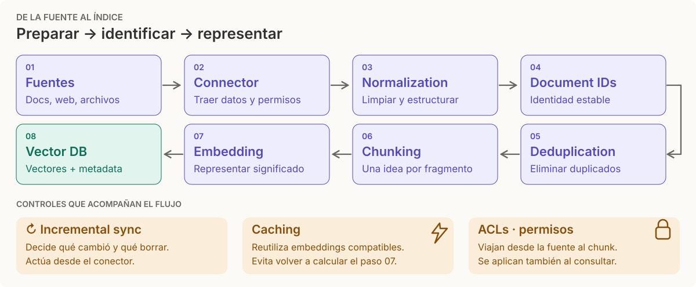
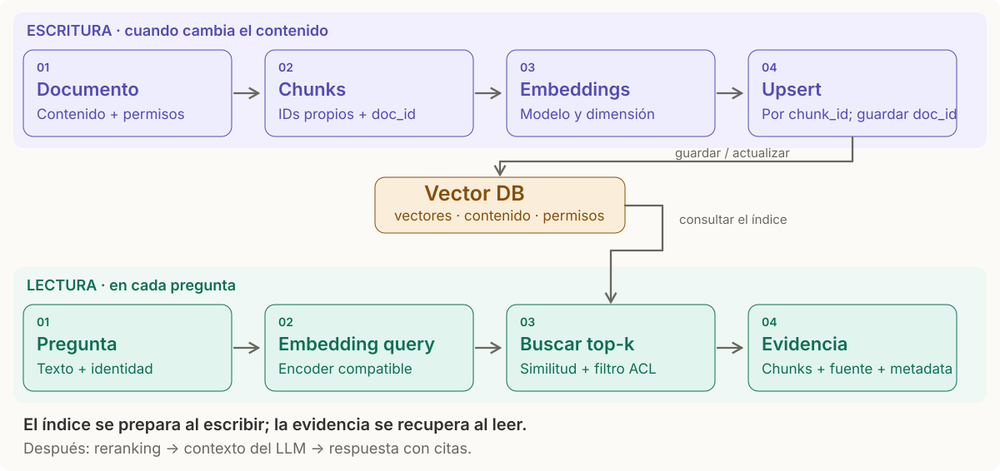

# Vector DB · pipeline de ingesta

> **En una frase:** una Vector DB responde "¿qué vectores se parecen a este?". El pipeline de ingesta es todo lo que pasa antes de que un documento se convierta en vectores útiles.

## Pipeline de ingesta

## Escritura vs lectura

Cada fragmento se guarda con su `chunk_id` y la referencia al `doc_id`. Si cambian los cortes o se elimina el documento, quitá también los chunks obsoletos.

## Preparación y actualización de datos
| Etapa | Pregunta que responde |
|---|---|
| [[Connector]] | ¿Cómo obtengo los datos? |
| [[Normalization]] | ¿Cómo hago que todo tenga la misma forma? |
| [[Incremental sync]] | ¿Cómo evito reprocesar todo? |
| [[Document IDs]] | ¿Cómo sigo el mismo documento en el tiempo? |
| [[Deduplication]] | ¿Cómo evito conocimiento repetido? |

**Controles transversales:** [[Caché de ingesta y búsqueda]] reutiliza trabajo desde Runtime; [[ACLs]] limita acceso desde Seguridad. Acompañan la ingesta y la consulta; no son etapas posteriores a deduplicar.

## Dos decisiones antes de indexar
| Decisión | Pregunta | Recordatorio |
|---|---|---|
| [[Chunking]] | ¿Qué unidad puede responder una pregunta? | Tamaño en tokens, límites por estructura y overlap |
| [[Modelos de embedding]] | ¿Cómo represento esa unidad para buscarla? | Modelo compatible, dimensión y métrica |

Si la fuente contiene imágenes, audio o video, revisá [[RAG multimedia]] antes de convertir todo a texto.

## Trade-offs
- Chunks chicos → más precisión, menos contexto. Chunks grandes → lo contrario.
- Metadata rica (fuente, fecha, acl) cuesta poco en ingesta y salva la vida en retrieval.
- Si la búsqueda exacta excede tu presupuesto de latencia o cómputo, compará con [[ANN HNSW]] y [[ANN IVF]]. La cantidad de vectores sola no decide.

## Se conecta con
[[ANN HNSW]] · [[RAG básico]] · [[Golden dataset]]
