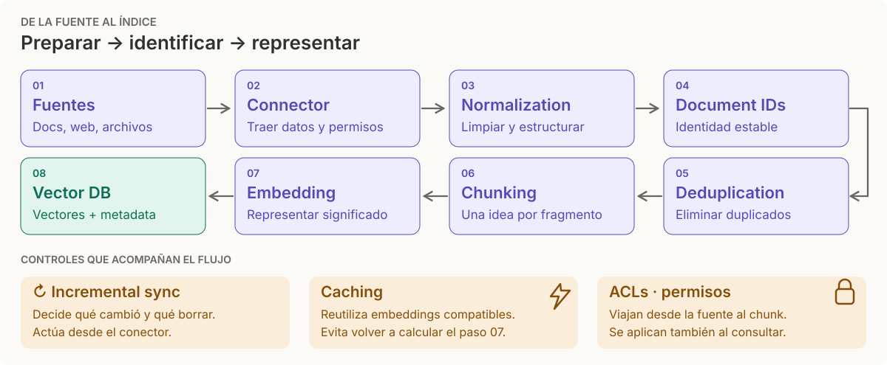
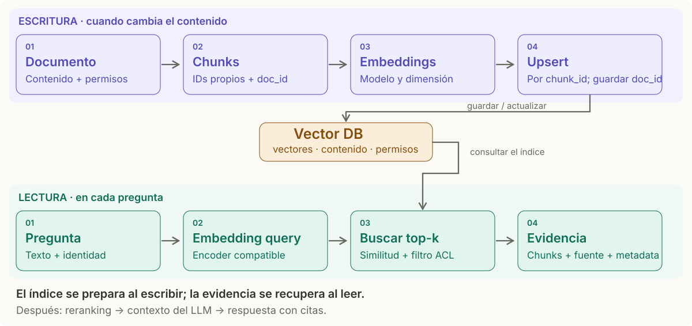

# Vector DB · pipeline de ingesta

> **En una frase:** una Vector DB responde "¿qué vectores se parecen a este?". El pipeline de ingesta es todo lo que pasa antes de que un documento se convierta en vectores útiles.

**Ir a:** [[#Configuración de una colección o índice|Configuración]] · [[#Parámetros del índice ANN|HNSW e IVF]] · [[#Diferencias entre implementaciones|Comparar bases]] · [[Clouds para Gen AI#VectorDB y recuperación - qué los diferencia|Comparar servicios cloud]].

## Pipeline de ingesta

## Escritura vs lectura

Cada fragmento se guarda con su `chunk_id` y la referencia al `doc_id`. Si cambian los cortes o se elimina el documento, quitá también los chunks obsoletos.

## Preparación y actualización de datos
| Etapa | Pregunta que responde |
|---|---|
| [[Connector]] | ¿Cómo obtengo los datos? |
| [[Normalization]] | ¿Cómo hago que todo tenga la misma forma? |
| [[Incremental sync]] | ¿Cómo evito reprocesar todo? |
| [[Document IDs]] | ¿Cómo sigo el mismo documento en el tiempo? |
| [[Deduplication]] | ¿Cómo evito conocimiento repetido? |

**Controles transversales:** [[Caché de ingesta y búsqueda]] reutiliza trabajo desde Runtime; [[ACLs]] limita acceso desde Seguridad. Acompañan la ingesta y la consulta; no son etapas posteriores a deduplicar.

## Dos decisiones antes de indexar
| Decisión | Pregunta | Recordatorio |
|---|---|---|
| [[Chunking]] | ¿Qué unidad puede responder una pregunta? | Tamaño en tokens, límites por estructura y overlap |
| [[Modelos de embedding]] | ¿Cómo represento esa unidad para buscarla? | Modelo compatible, dimensión y métrica |

Si la fuente contiene imágenes, audio o video, revisá [[RAG multimedia]] antes de convertir todo a texto.

## Trade-offs
- Chunks chicos → más precisión, menos contexto. Chunks grandes → lo contrario.
- Metadata rica (fuente, fecha, acl) cuesta poco en ingesta y salva la vida en retrieval.
- Si la búsqueda exacta excede tu presupuesto de latencia o cómputo, compará con [[ANN HNSW]] y [[ANN IVF]]. La cantidad de vectores sola no decide.

## Qué estás configurando

| Pieza | Responsabilidad |
|---|---|
| Base vectorial | Guarda vectores, IDs y metadatos; ofrece consultas y operaciones sobre esos registros. |
| Índice vectorial | Estructura que acelera la búsqueda, por ejemplo HNSW o IVF. Es parte de la base, no todo su almacenamiento. |
| Librería de búsqueda | Implementa algoritmos; la aplicación debe resolver persistencia, permisos y servicio si no vienen incluidos. |
| Pipeline RAG | Obtiene documentos, crea embeddings, recupera evidencia y construye la respuesta. Puede usar una base vectorial como una de sus piezas. |

## Configuración de una colección o índice

| Decisión | Qué cambia y cómo comprobarlo |
|---|---|
| **Embedding y dimensiones** | Documentos y preguntas deben usar el mismo espacio de embeddings: modelo, versión y configuración compatibles. Tener igual dimensión no garantiza compatibilidad. Al cambiarlo, regenerá vectores y migrá el índice. |
| **Distancia** | Coseno compara orientación; producto interno también depende de la magnitud; L2 mide distancia euclídea. Elegí según el modelo y su normalización. El score no es una probabilidad universal. |
| **Top K** | Cantidad de candidatos solicitados. Más candidatos permiten rescatar evidencia para reranking, pero agregan trabajo y contexto. Separá K de recuperación del número de fragmentos enviados al modelo. |
| **Metadatos y filtros** | Guardá `doc_id`, `chunk_id`, versión, fuente y permisos. Aplicá el alcance autorizado en la recuperación. Los filtros selectivos pueden cambiar recall y latencia: probá consultas reales con filtros. |
| **Exacta o ANN** | Exacta compara todos los candidatos elegibles; ANN explora una parte y puede omitir vecinos. Medí recall frente a la búsqueda exacta, además de latencia y memoria. |
| **Híbrida y reranking** | Híbrida combina búsqueda semántica y léxica; la fusión reúne sus candidatos. El reranker reordena esos candidatos con otra señal. No recupera un documento que quedó fuera de todos ellos. |

La dimensión y la métrica pertenecen a la configuración del índice de vectores propios en [Pinecone](https://docs.pinecone.io/guides/index-data/create-an-index). Los campos estructurados permiten restringir candidatos mediante [filtros de metadatos](https://docs.pinecone.io/guides/search/filter-by-metadata). Para el diseño de consultas, seguí [[Búsqueda híbrida y reranking]].

## Parámetros del índice ANN

**HNSW construye un grafo.** `M` limita sus conexiones; aumentarlo consume más memoria. `efConstruction` amplía los candidatos al construirlo: puede mejorar recall y tarda más. `efSearch` amplía la exploración en consulta: puede mejorar recall y aumenta latencia. Estos parámetros no equivalen a Top K.

| Producto | Construcción | Consulta |
|---|---|---|
| pgvector HNSW | `m`, `ef_construction` | `hnsw.ef_search` |
| Qdrant HNSW | `m`, `ef_construct` | `hnsw_ef` |
| Milvus HNSW | `M`, `efConstruction` | `ef` |

Los nombres y límites son específicos del producto: [pgvector](https://github.com/pgvector/pgvector#hnsw), [Qdrant: construcción](https://qdrant.tech/documentation/manage-data/indexing/) y [consulta](https://qdrant.tech/documentation/search/search/), [Milvus](https://milvus.io/docs/hnsw.md). Qdrant también utiliza índices de payload para buscar con filtros.

**IVF agrupa vectores en listas.** En Milvus IVF_FLAT, `nlist` controla las listas al construir y `nprobe` cuántas se exploran en consulta. En pgvector IVFFlat se llaman `lists` e `ivfflat.probes`. Más listas exploradas suelen mejorar recall con mayor trabajo. IVF necesita datos representativos para formar sus agrupaciones. Consultá [Milvus IVF_FLAT](https://milvus.io/docs/ivf-flat.md) y [pgvector IVFFlat](https://github.com/pgvector/pgvector#ivfflat).

No copies parámetros entre productos ni uses valores universales. Ajustá con [[Golden dataset]], filtros reales y carga concurrente; medí también inserciones y reconstrucción. En pgvector, los filtros posteriores al escaneo ANN pueden devolver menos resultados; los escaneos iterativos permiten ampliar la búsqueda dentro de límites configurados.

## Diferencias entre implementaciones

| Opción | Qué aporta | Decisión que queda en tus manos |
|---|---|---|
| **pgvector** | Extensión de PostgreSQL: vectores junto a datos relacionales, SQL y transacciones. Exacta, HNSW e IVFFlat. | Operar Postgres, índices, particiones y capacidad; combinar texto completo con búsqueda vectorial. |
| **Qdrant** | Base especializada: HNSW y filtros sobre payload indexado. | Elegir colección, índices de filtros y despliegue; ajustar recursos para tu carga. |
| **Pinecone** | Servicio gestionado; índice con dimensión/métrica y namespaces para separar datos. | Elegir embedding, región, namespace y filtros; medir comportamiento con tu volumen y carga. |
| **Milvus** | Base especializada con familias de índices, incluyendo HNSW e IVF_FLAT. | Elegir índice y parámetros según memoria, recall y patrón de consultas; operar el despliegue elegido. |

Son diferencias de arquitectura, no un ranking de calidad. Las configuraciones se documentan en las fuentes anteriores. Pinecone describe el aislamiento por namespace para su [arquitectura serverless](https://docs.pinecone.io/guides/index-data/implement-multitenancy); Qdrant ofrece estrategias de [multitenencia](https://qdrant.tech/documentation/manage-data/multitenancy/).

## Operación: además de encontrar vecinos

- **Aislamiento:** elegí alcance por cliente y aplicá permisos en el servidor. Un filtro `tenant_id` no reemplaza autenticación ni autorización; nunca aceptes ese alcance directamente del usuario sin validarlo.
- **Durabilidad:** distinguí escritura confirmada, persistencia, réplica y backup. Definí recuperación ante fallos y verificá restauración; ninguna elección de HNSW/IVF resuelve esto por sí sola.
- **Actualizaciones:** usá IDs estables y versiones; hacé upsert, eliminá chunks obsoletos y comprobá cuándo una escritura aparece en búsqueda. Al migrar embeddings, prepará el índice nuevo y validalo antes de cambiar consultas.
- **Escalado:** medí almacenamiento, memoria del índice, ingestión y consultas simultáneas. Réplicas, particiones o shards distribuyen cargas distintas; revisá también el efecto en filtros y aislamiento.

## Se conecta con
En consulta: [[Query rewrite]] → [[Bi-encoder]] consulta este índice → [[Búsqueda híbrida y reranking]] → [[Cross-encoder]] → contexto y respuesta.

[[ANN HNSW]] · [[RAG básico]] · [[Golden dataset]]

En los clouds: [[Amazon Bedrock Knowledge Bases]] · [[Vertex AI Vector Search]] · [[Azure AI Search]]. Cada nota detalla qué parte del pipeline gestiona el servicio y qué parámetros podés configurar.
