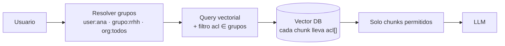
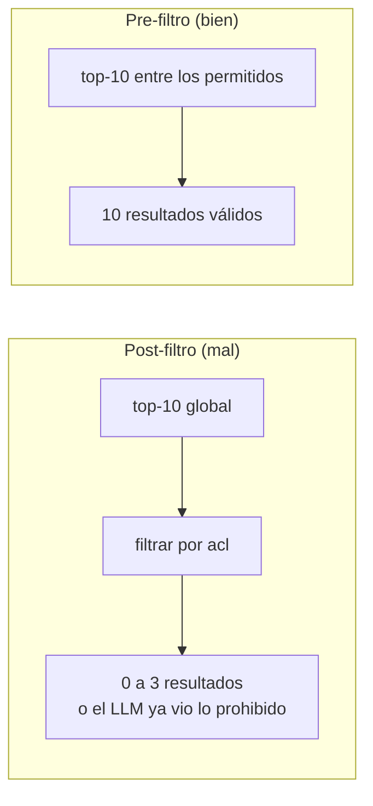

# ACLs

> **En una frase:** cómo evito que un usuario vea datos que no debería. Los permisos viajan con cada chunk desde la fuente y se aplican **dentro** de la búsqueda, no después.

## Diagrama

## Pre-filtro vs post-filtro

Post-filtrar el top-k puede dejar la lista vacía, y si el filtro lo hace el prompt en vez de la DB, el dato ya se filtró al contexto.

## Cómo modelarlo
- Cada chunk guarda `acl: ["user:…", "grupo:…"]` heredado del documento ([[Normalization]] lo pone en el esquema).
- El [[Connector]] trae los permisos de la fuente (Drive sharing, Notion members) y sus cambios.
- Cambio de permisos = evento de [[Incremental sync]]: hay que re-escribir la metadata aunque el texto no cambie.

## Trade-offs
- Filtros muy selectivos degradan [[ANN HNSW]]: el grafo pierde vecinos válidos. Probá con tus grupos reales.
- [[Caching]] de respuestas por encima del filtro filtra datos: la key debe incluir la identidad.
- Para auditoría, loggeá qué chunks se mostraron a quién.
