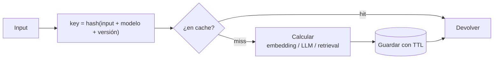

# Caching

> **En una frase:** cómo ahorro costo y latencia. Todo lo que es determinístico dado el input (embeddings, respuestas del LLM, resultados de retrieval) se calcula una vez y se guarda.

## Diagrama

## Qué cachear
| Capa | Key | TTL | Ahorra |
|---|---|---|---|
| Embeddings | `hash(chunk_text, modelo)` | Infinito mientras no cambie el modelo | Casi todo el costo de re-ingesta |
| Respuestas LLM | `hash(prompt completo, modelo, temp=0)` | Horas a días | Tokens y latencia en preguntas repetidas |
| Retrieval | `hash(query normalizada, filtros, versión del índice)` | Minutos | Latencia en picos |
| Prompt cache (API) | Prefijo del prompt (system + docs) | Minutos | Tokens de input en multi-turn |

## Reglas
- La key incluye la **versión** del modelo y del índice. Cambiar el modelo de embeddings sin invalidar la cache es el bug clásico.
- Con [[Incremental sync]] + cache de embeddings, re-sincronizar cuesta solo lo que cambió.
- Cache de respuestas y [[ACLs]] no se llevan bien: la key tiene que incluir los permisos del usuario, o cacheás por debajo del filtro.

> [!TIP] Orden de impacto
> Embeddings primero (gratis y sin riesgo), prompt caching segundo, respuestas completas último y solo si tenés queries realmente repetidas.
