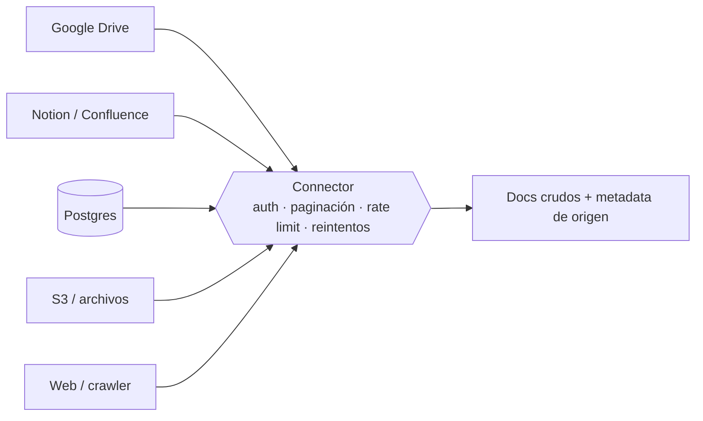

# Connector

> **En una frase:** cómo obtengo los datos. El connector habla el idioma de cada fuente (API, DB, archivos) y entrega documentos crudos al pipeline de [[Vector DB]].

## Diagrama

## Tres formas de traer datos
| Modo | Cómo | Cuándo |
|---|---|---|
| Pull (polling) | Preguntás cada N minutos qué hay | Simple, sirve para casi todo |
| Webhook / push | La fuente te avisa cuando algo cambia | La frescura importa y la fuente lo soporta |
| Change feed / CDC | Leés el log de cambios de la DB | Volumen alto, necesitás los borrados |

## Lo que cada connector tiene que devolver
- Contenido crudo sin transformar → transformar es trabajo de [[Normalization]].
- `source_id` estable de la fuente → base de los [[Document IDs]].
- `updated_at` o cursor → base del [[Incremental sync]].
- Quién puede verlo → base de los [[ACLs]].

> [!WARNING] Errores clásicos
> Olvidar los borrados (la fuente ya no tiene el doc pero vos sí) y no respetar rate limits (te bloquean la API).
