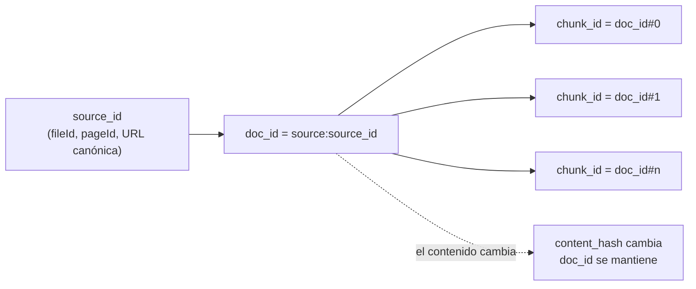

# Document IDs

> **En una frase:** cómo sigo el mismo documento a lo largo del tiempo. El ID viene de la fuente, no del contenido, así un doc editado o movido sigue siendo el mismo doc.

## Diagrama

## Qué ID usar
| Fuente | ID estable | Trampa |
|---|---|---|
| Drive / Notion | fileId / pageId | El título cambia, el ID no |
| Web | URL canónica (sin utm, sin trailing slash) | Redirects y duplicados |
| DB | tabla + primary key | Migraciones que renumeran |
| Archivos locales | ruta, o hash si son inmutables | Mover = "nuevo doc" si usás la ruta |

## Para qué sirve tener IDs estables
- [[Incremental sync]]: "modificado" solo existe si podés decir "es el mismo doc".
- Upsert en la [[Vector DB]]: borrás todos los `chunk_id` con prefijo `doc_id` y reescribís.
- Citas: el usuario ve la fuente, no un chunk anónimo.
- [[Deduplication]] separa "mismo doc actualizado" de "otro doc copiado".

> [!TIP] Determinístico > aleatorio
> Nunca uses UUID random en ingesta: reprocesás el mismo doc, obtenés otro ID, y ahora tenés dos.
