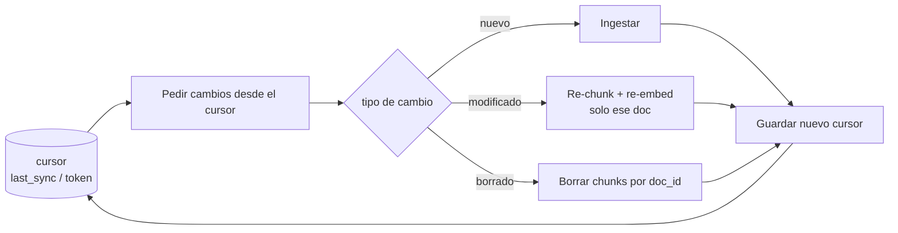

# Incremental sync

> **En una frase:** cómo evito reprocesar todo. Guardo hasta dónde llegué la última vez y solo traigo lo que cambió desde entonces.

## Diagrama

## Cómo saber qué cambió
| Estrategia | Cómo | Costo |
|---|---|---|
| `updated_at` | `WHERE updated_at > last_sync` | Barato, pero no detecta borrados |
| Hash de contenido | Comparás hash guardado vs actual | Detecta cambios reales, hay que leer todo |
| Cursor / change token | La API te da un token (Drive, Notion, CDC) | El mejor: nuevos, cambios y borrados |

## Reglas
- El cursor se guarda **después** de procesar, nunca antes. Si falla a mitad, reintentás.
- Los borrados son lo que todos olvidan; sin ellos la [[Vector DB]] acumula basura.
- Necesita [[Document IDs]] estables: si el ID cambia, "modificado" se ve como "nuevo + huérfano".
- Un full re-sync periódico (semanal) atrapa lo que el incremental se perdió.
- Con [[Caching]] de embeddings, re-sincronizar cuesta solo los chunks que cambiaron.
