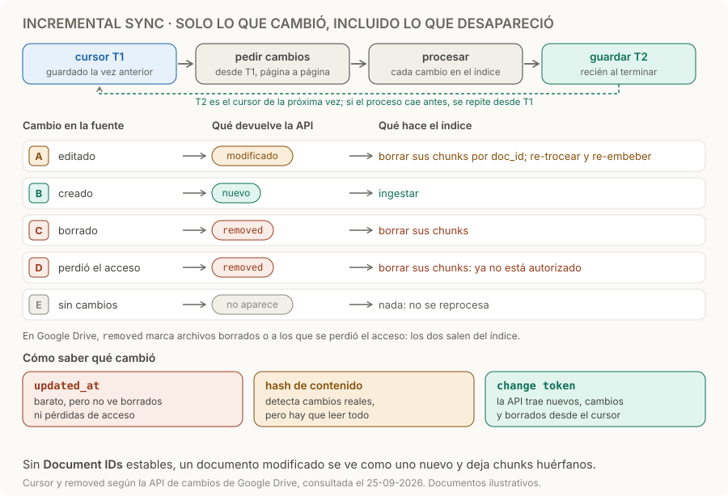

# Incremental sync

> **En una frase:** cómo evito reprocesar todo. Guardo hasta dónde llegué la última vez y solo traigo lo que cambió desde entonces.

## Cómo funciona
1. **Cursor.** Guardás un marcador de hasta dónde procesaste: una fecha, un token de la API o una posición en un log de cambios.
2. **Pedir cambios.** Le pedís a la fuente lo que cambió desde el cursor, página a página.
3. **Aplicar cada cambio** al índice según su tipo: nuevo, modificado o eliminado.
4. **Guardar el cursor nuevo** recién cuando terminaste. Si el proceso cae antes, la próxima corrida repite desde el cursor anterior, y como cada cambio se aplica por `doc_id`, repetirlo no duplica nada.

En Google Drive, el primer token sale de `changes.getStartPageToken`. `changes.list` devuelve `nextPageToken` mientras quedan páginas y, al final, un `newStartPageToken`, que es el que se guarda para la próxima vez. Cada cambio con `removed: true` indica un archivo borrado **o al que se perdió el acceso**. Con `changes.watch` podés recibir un aviso de que hay cambios, pero el aviso no trae el detalle: igual hay que pedirlos. [Cambios en Drive](https://developers.google.com/workspace/drive/api/guides/manage-changes) · [Recurso Change](https://developers.google.com/workspace/drive/api/reference/rest/v3/changes).

## Cómo saber qué cambió
| Estrategia | Cómo | Costo |
|---|---|---|
| `updated_at` | `WHERE updated_at > last_sync` | Barato, pero no detecta borrados ni pérdidas de acceso |
| Hash de contenido | Comparás hash guardado vs actual | Detecta cambios reales, hay que leer todo |
| Cursor / change token | La API te da un token (Drive, Notion, CDC) | El mejor: nuevos, cambios y borrados |

## Reglas
- El cursor se guarda **después** de procesar, nunca antes. Si falla a mitad, reintentás.
- Los borrados son lo que todos olvidan; sin ellos la [[Vector DB]] acumula basura.
- Una pérdida de acceso también es un borrado para el índice: si el documento sigue ahí, el RAG puede mostrarlo a quien ya no debería verlo ([[ACLs]]).
- Necesita [[Document IDs]] estables: si el ID cambia, "modificado" se ve como "nuevo + huérfano".
- Un modificado se aplica borrando los chunks viejos de ese `doc_id` antes de insertar los nuevos; si no, conviven dos versiones.
- Un full re-sync periódico (semanal) atrapa lo que el incremental se perdió.
- Con [[Caché de ingesta y búsqueda]] de embeddings, re-sincronizar cuesta solo los chunks que cambiaron.

> [!TIP] Para recordar
> **Cursor después de procesar, cambios aplicados por `doc_id`, y los borrados y pérdidas de acceso también salen del índice.**

## Practicá
> [!question]- El sync incremental corre cada hora con `updated_at`, y un usuario encuentra en las respuestas un documento que se borró hace una semana. ¿Qué pasó?
> `updated_at` solo ve lo que existe y cambió: un documento borrado ya no aparece en la consulta, así que nunca se marcó para eliminar y sus chunks siguen en el índice. Pasá a un change token que traiga los borrados o, si la fuente no lo ofrece, compará periódicamente la lista de `doc_id` del índice con la de la fuente y eliminá los que falten. El full re-sync semanal atrapa lo que se escape.

> [!question]- El proceso cae después de aplicar la mitad de los cambios. ¿Qué pasa en la próxima corrida?
> Como el cursor se guarda al final, sigue siendo el anterior y la corrida vuelve a pedir los mismos cambios. Los que ya se aplicaron se repiten sin daño porque cada operación es por `doc_id`: reemplazar los chunks de A dos veces deja lo mismo, y borrar C dos veces también. Si guardaras el cursor antes de procesar, esos cambios se perderían para siempre.

> [!question]- A un usuario le quitan el acceso a una carpeta de Drive. ¿Qué tiene que pasar en tu índice?
> Los documentos de esa carpeta llegan como `removed` para ese usuario o esa cuenta, y hay que sacarlos del índice o de su filtro de permisos antes de la próxima búsqueda. Si el índice es compartido y otros sí tienen acceso, no se borran: se actualizan sus ACL. En los dos casos, el retrieval tiene que filtrar por permisos al consultar, no solo confiar en el sync: [[ACLs]].

## Se conecta con
[[Connector]] · [[Document IDs]] · [[Deduplication]] · [[Vector DB]] · [[ACLs]] · [[Caché de ingesta y búsqueda]]
