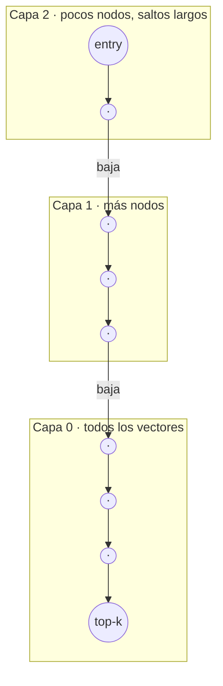

# ANN · HNSW

> **En una frase:** comparar la query contra todos los vectores es O(n). HNSW arma un grafo en capas que llega a los vecinos correctos visitando una fracción mínima de los nodos.

## Diagrama

Búsqueda: entrás por arriba, en cada capa saltás al vecino más cercano a la query (greedy) y cuando dejás de mejorar bajás una capa. Es una skip list en espacio vectorial.

## Los 3 parámetros que importan
| Parámetro | Qué controla | Subirlo → |
|---|---|---|
| `M` | Conexiones por nodo | Más recall, más RAM |
| `efConstruction` | Candidatos al construir | Mejor índice, ingesta más lenta |
| `efSearch` | Candidatos al buscar | Más recall, más latencia |

## Cuándo sí / cuándo no
| Usalo cuando | Evitalo cuando |
|---|---|
| > ~100k vectores y necesitás milisegundos | < 10k vectores: fuerza bruta es más simple y exacta |
| Podés pagar RAM (el grafo vive en memoria) | El índice no entra en RAM → IVF-PQ / DiskANN |
| Recall 95–99% alcanza | Necesitás 100% exacto |

## Trade-offs
- Es aproximado: medí recall@k contra búsqueda exacta con tu [[Golden dataset]].
- Filtrar por metadata (ej. [[ACLs]]) durante la búsqueda degrada el grafo. Los DBs modernos hacen "filtered HNSW", pero probalo con tus filtros reales.

## Se conecta con
[[Vector DB]] · [[RAG]]
