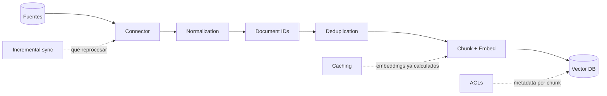
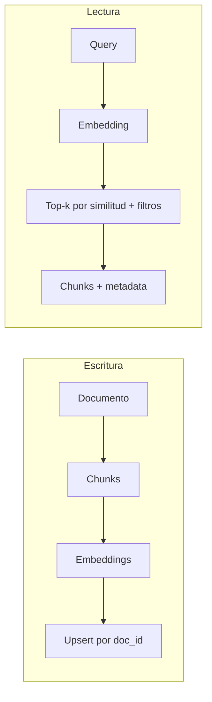

# Vector DB · pipeline de ingesta

> **En una frase:** una Vector DB responde "¿qué vectores se parecen a este?". El pipeline de ingesta es todo lo que pasa antes de que un documento se convierta en vectores útiles.

## Diagrama

## Las 7 preguntas del pipeline
| Etapa | Pregunta que responde |
|---|---|
| [[Connector]] | ¿Cómo obtengo los datos? |
| [[Normalization]] | ¿Cómo hago que todo tenga la misma forma? |
| [[Incremental sync]] | ¿Cómo evito reprocesar todo? |
| [[Document IDs]] | ¿Cómo sigo el mismo documento en el tiempo? |
| [[Deduplication]] | ¿Cómo evito conocimiento repetido? |
| [[Caching]] | ¿Cómo ahorro costo y latencia? |
| [[ACLs]] | ¿Cómo evito que alguien vea lo que no debe? |

## Escritura vs lectura

## Trade-offs
- Chunks chicos → más precisión, menos contexto. Chunks grandes → lo contrario.
- Metadata rica (fuente, fecha, acl) cuesta poco en ingesta y salva la vida en retrieval.
- De miles a millones de vectores la búsqueda exacta no escala → [[ANN HNSW]].

## Se conecta con
[[ANN HNSW]] · [[RAG]] · [[Golden dataset]]
