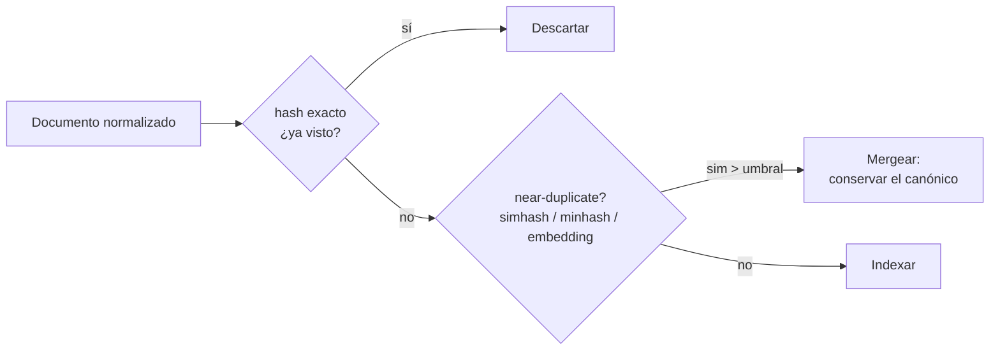

# Deduplication

> **En una frase:** cómo evito conocimiento repetido. Si el mismo texto entra tres veces, el top-k devuelve tres copias y el LLM ve menos contexto distinto.

## Diagrama

## Tres niveles
| Nivel | Detecta | Técnica | Costo |
|---|---|---|---|
| Exacto | Copias byte a byte | `sha256(text)` | Casi cero |
| Casi exacto | Mismo texto con cambios menores | MinHash / SimHash sobre shingles | Bajo |
| Semántico | Mismo contenido dicho distinto | Similitud de embeddings > 0.95 | Medio, con falsos positivos |

## Dónde aparece la duplicación
- El mismo PDF subido a Drive y a Notion: distinto [[Document IDs]], mismo contenido.
- Versiones v1, v2, v3 del mismo documento conviviendo.
- Boilerplate: cada página tiene el mismo footer legal. Parece contenido, es ruido ([[Normalization]] lo saca antes).
- El overlap entre chunks es duplicación intencional: no lo dedupliques.

## Trade-offs
- Por documento es más barato; por chunk atrapa más.
- Umbral semántico alto → se cuelan duplicados; bajo → mergeás cosas distintas. Medilo con tu [[Golden dataset]].
