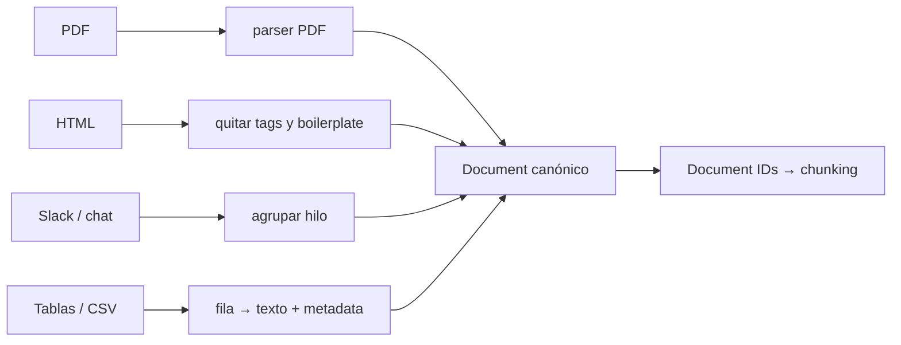

# Normalization

> **En una frase:** cómo hago que todos los datos se vean igual. Venga de un PDF, un HTML o un hilo de Slack, después de este paso todo es un `Document` con la misma forma.

## Diagrama


## El contrato: un solo esquema
```json
{
  "doc_id": "drive:1a2b3c",
  "source": "drive",
  "title": "Política de vacaciones",
  "text": "…texto limpio, sin headers repetidos…",
  "updated_at": "2026-09-01T10:00:00Z",
  "acl": ["grupo:rrhh", "user:ana"],
  "metadata": { "author": "…", "url": "…", "lang": "es" }
}
```
Todo lo que viene después (chunking, [[Deduplication]], [[ACLs]]) se programa una sola vez contra este esquema, no una vez por fuente.

## Qué limpiar sí o sí
- Headers y footers repetidos, menús de navegación, firmas de mail.
- Encoding y saltos de línea rotos (los PDFs son el enemigo).
- Tablas: pasarlas a markdown o a filas con metadata; un LLM no lee columnas separadas por espacios.

> [!TIP] Regla
> Normalizá texto y metadata, pero **no** resumas ni descartes contenido acá. Eso es decisión de chunking o retrieval, y es irreversible.
