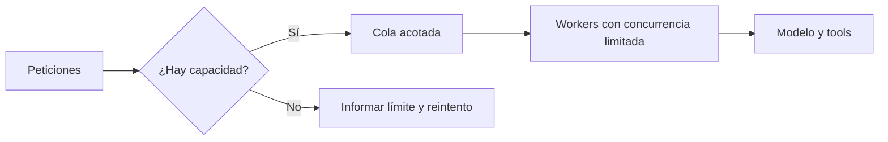

# Despliegue y operación bajo carga

> **En una frase:** limitá cuánto trabajo aceptás y publicá cambios de a poco, con criterios para detenerlos.

## Absorber picos
- **Cola:** desacopla llegada y procesamiento; sirve para tareas que toleran espera. Medí profundidad y edad del trabajo pendiente.
- **Concurrencia y cuotas:** limitá llamadas simultáneas y consumo por cliente/proveedor. Cada tarea conserva timeout y presupuesto.
- **Backpressure:** frená o rechazá entradas cuando no hay capacidad; una cola infinita convierte sobrecarga en espera infinita. Los reintentos de mensajes requieren [[Ejecución y recuperación|idempotencia]].

Una cola amortigua picos, pero no aumenta la capacidad sostenida del sistema. [Patrón de colas](https://learn.microsoft.com/en-us/azure/architecture/patterns/queue-based-load-leveling).

## Publicar con control
1. **Objetivos:** definí SLOs —objetivos de servicio— con ventana y población: por ejemplo, 99% de tareas sin error técnico en 7 días. Medí calidad y costo aparte.
2. **Canary:** tras pasar evals, enviá una fracción pequeña de tráfico a la versión nueva y comparala con la anterior.
3. **Avanzar o revertir:** fijá antes límites de errores, latencia, calidad y costo; reuní evidencia suficiente antes de ampliar tráfico.

Versioná juntos prompt, modelo, tools e índice. Volver atrás requiere compatibilidad del estado; no deshace acciones externas. [Despliegues canary](https://sre.google/workbook/canarying-releases/).

## Practicá
> [!question]- Si llegan tareas más rápido de lo que salen, ¿qué límite protege al usuario y al proveedor?
> Dos límites distintos. Al proveedor lo protegen la concurrencia máxima y las cuotas por cliente: los workers no hacen más llamadas simultáneas que las acordadas, por más que crezca la cola. Al usuario lo protege el tope de la cola: cuando se llena, o la tarea más vieja supera un tiempo máximo, rechazás las nuevas con un mensaje claro y cuándo reintentar, en lugar de dejarlas esperando sin fin. Si el exceso es sostenido, la cola solo lo posterga: hace falta más capacidad o menos carga.

## Se conecta con
[[Operación en producción]] · [[Trazas y debugging]]
