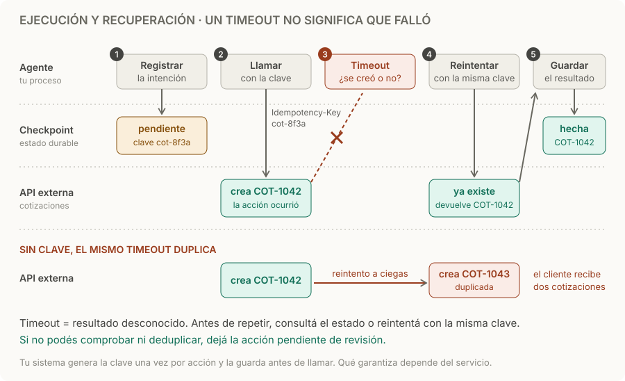

# Ejecución y recuperación

> **En una frase:** guardá el progreso fuera del proceso y, antes de repetir una acción con efectos, comprobá si ya ocurrió.

## Cómo funciona
1. **Registrar antes de actuar.** Guardá en estado durable qué acción vas a hacer, con qué argumentos y una clave única para esa acción. Si el proceso cae, al retomar sabés qué quedó a medias.
2. **Llamar con la clave.** Un servicio que admite idempotencia guarda el resultado de la primera petición con esa clave y lo devuelve en los reintentos, sin repetir el efecto.
3. **Timeout significa resultado desconocido.** La acción pudo ocurrir aunque la respuesta no llegó. Consultá el estado o reintentá con la **misma** clave.
4. **Guardar el resultado.** Recién entonces marcás la acción como hecha, con el ID que devolvió el servicio.
5. **Límites.** Fijá pasos, tiempo y costo máximos; cuando se agotan, guardá el estado y terminá de forma explícita.

Stripe, por ejemplo, guarda el código y el cuerpo de la primera respuesta para cada clave, incluso un error 500. Si llega la misma clave con otros parámetros, responde con error, y puede descartar las claves después de 24 horas. [Idempotencia en Stripe](https://docs.stripe.com/api/idempotent_requests).

## Dónde puede caer el proceso
| Momento de la falla | ¿Ocurrió la acción? | Qué hacer al retomar |
|---|---|---|
| Antes de llamar | No | Llamar con la clave ya registrada |
| Durante la llamada (timeout) | No se sabe | Consultar el estado o reintentar con la misma clave |
| Con la respuesta recibida, pero sin guardar | Sí | Reintentar con la misma clave devuelve el resultado; o consultar |
| Después de guardar | Sí, y lo sabés | Continuar |

Un **checkpoint** guarda el progreso fuera de la memoria del proceso; LangGraph, por ejemplo, persiste el estado del grafo por `thread_id` para tolerar fallas. [Persistencia en LangGraph](https://docs.langchain.com/oss/javascript/langgraph/persistence). Pero persistir mensajes no demuestra que una acción externa terminó: al retomar, un paso puede ejecutarse de nuevo, así que los pasos con efectos tienen que ser idempotentes o comprobar antes de repetir.

## Ejemplo
Crear una cotización da timeout. El agente había registrado `pendiente · cot-8f3a` antes de llamar, así que reintenta con esa clave y la API devuelve COT-1042, la que ya había creado. Sin clave, el reintento crea COT-1043 y el cliente recibe dos cotizaciones.

## Qué hacer según la acción
| Acción | Estrategia |
|---|---|
| Lectura: consultar un pedido | Reintentar sin problema; no tiene efectos |
| Escritura con clave de idempotencia | Reintentar con la misma clave |
| Escritura sin clave, pero consultable | Buscar primero por una referencia propia; crear solo si no existe |
| Escritura sin clave ni consulta: un email, un sistema legado | No reintentar automáticamente; dejar pendiente de revisión |

## Trampas
- **Clave nueva en cada intento.** Si la generás al llamar y no la guardás antes, al retomar se genera otra y el servicio no reconoce el reintento.
- **Misma clave, otros datos.** Si cambian los argumentos, es otra acción: usá otra clave.
- **Reintentos multiplicados.** SDK, runtime y orquestador reintentando a la vez. Definí una sola capa responsable: [[Resiliencia entre proveedores]].
- **Claves que vencen.** Si retomás días después, la clave pudo expirar; consultá el estado antes de reintentar.
- **Cancelar no deshace.** Lo ya confirmado necesita una acción compensatoria aparte: [[Streaming y cancelación]].

> [!TIP] Para recordar
> **Timeout significa “no sé”, no “falló”. Registrá la clave antes de llamar y reintentá con la misma.**

## Practicá
> [!question]- ¿Qué pasa si el proceso cae después de crear la cotización y antes de guardar su respuesta?
> La cotización existe, pero el checkpoint dice “pendiente”. Al retomar, el paso se repite: con la clave registrada, la API devuelve COT-1042 y la guardás; sin clave, creás una duplicada. Si no hay clave, buscá primero por una referencia propia, como el ID del pedido, antes de crear.

> [!question]- Generás la clave con un UUID nuevo justo antes de llamar y el proceso cae después de la llamada. ¿La clave te protege al retomar?
> No. Al retomar se genera otro UUID y el servicio lo trata como una petición nueva. La clave tiene que guardarse en el checkpoint antes de llamar, o derivarse de la acción (por ejemplo `cotizacion:{pedido}:{version}`), para que el reintento use la misma.

> [!question]- Una tool envía un email, el proveedor no admite claves y la llamada da timeout. ¿Qué hacés?
> No reintentes a ciegas: un email duplicado no se puede deshacer. Consultá el estado si el proveedor lo permite, por ejemplo con el registro de envíos. Si no, marcá la acción como incierta y pedí revisión, o aceptá el riesgo de duplicar de forma explícita según su impacto: [[Control humano y permisos]].

## Se conecta con
[[Streaming y cancelación]] · [[Trazas y debugging]] · [[Resiliencia entre proveedores]] · [[Tools y function calling]] · [[MCP stateless y estado]]
