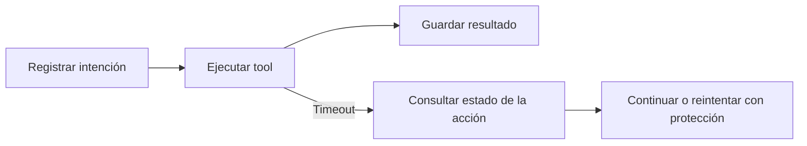

# Ejecución y recuperación

> **En una frase:** guardá el progreso y verificá qué ocurrió antes de repetir una acción.

## Tres ideas
- **Estado durable:** un checkpoint guarda el progreso fuera de la memoria del proceso. Persistir mensajes no demuestra que una acción externa terminó.
- **Idempotencia:** una clave estable por acción permite que un servicio compatible reconozca reintentos y evite duplicados.
- **Límites:** fijá pasos, tiempo y costo máximos; cuando se agotan, guardá el estado y terminá de forma explícita.

**Ejemplo:** crear una cotización da timeout. Consultá por su identificador antes de volver a crearla. Si no podés comprobarlo ni deduplicar, dejá la acción pendiente de revisión.

> [!TIP] Para recordar
> Timeout significa resultado desconocido; no prueba que la acción falló.

**Practicá:** ¿qué pasa si el proceso cae después de crear la cotización y antes de guardar su respuesta?

[[Streaming y cancelación]] · [[Trazas y debugging]]
