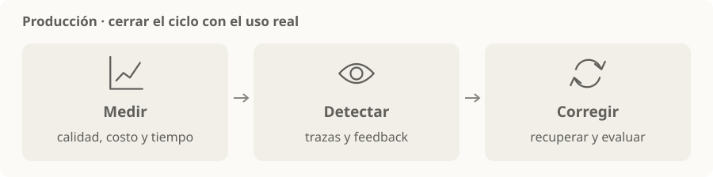

# Operación en producción

> **En una frase:** observar el sistema con usuarios reales, detectar problemas y poder recuperarse sin perder el control de calidad, costo o tiempo.

## Qué mirar
| Aspecto | Recordatorio |
|---|---|
| Calidad | Tareas resueltas, feedback y casos nuevos para el [[Golden dataset]] |
| Observabilidad | Trazas de llamadas, herramientas, fuentes y errores |
| Tiempo y costo | Latencia, consumo y costo por tarea resuelta |
| Fallas | Timeouts, límites, reintentos y alternativas |
| Cambios | Versionar modelo, prompt e índice; poder volver a una versión anterior |

**Ejemplo:** aumenta el tiempo de respuesta tras cambiar el modelo. Comparás trazas y métricas con la versión previa, y revertís si el resultado no cumple el objetivo.

## Antes y después de publicar
- **Antes:** casos controlados y comparación con la versión anterior.
- **Después:** monitoreo, muestras de conversaciones y feedback real.
- **De vuelta a evals:** convertir fallas observadas en casos de regresión.

Las pruebas offline y el seguimiento en producción se complementan. [Evaluación de agentes](https://www.anthropic.com/engineering/demystifying-evals-for-ai-agents).

> [!TIP] Para recordar
> Reintentar una lectura y reintentar un cobro tienen consecuencias distintas. Evitá duplicar acciones y protegé la información que registrás.

[[Evals]] · [[Caché de ingesta y búsqueda]] · [[Control humano y permisos]] · [[LLMs y elección de modelo]]

Para profundizar: [[Runtime de agentes]] · [[Trazas y debugging]] · [[Evals por cliente y producción]].

Para controlar picos y publicar gradualmente: [[Despliegue y operación bajo carga]].
