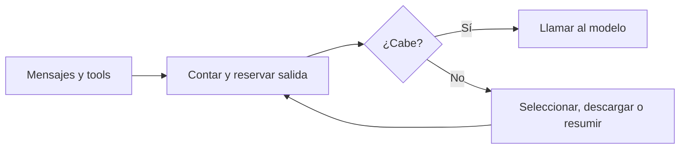

# Presupuesto de contexto

> **En una frase:** contá lo que entra, reservá salida y conservá lo necesario para continuar correctamente.

## Tres ideas
- **Contar:** incluí instrucciones, historial, esquemas y contenido multimodal. Usá mecanismos del proveedor y contrastá con el consumo reportado; no calcules por caracteres.
- **Descargar —offload—:** guardá resultados grandes fuera del prompt; incorporá un extracto y una referencia recuperable con permisos.
- **Compactar:** preservá decisiones, IDs, restricciones y tareas pendientes. Evaluá si el resumen pierde información necesaria.

**Ejemplo:** una tool devuelve un PDF enorme. Conservá el original, recuperá páginas relevantes y mantené referencias para volver a la evidencia.

> [!TIP] Para recordar
> Que el contexto quepa no significa que contenga la información correcta. El conteo previo también puede tener limitaciones.

**Practicá:** ¿qué información nunca eliminarías al resumir una ejecución pendiente de aprobación?

[[Resiliencia entre proveedores]] · [[Seguridad y evidencia documental]]

[[Prompt caching]] reduce trabajo repetido sobre la entrada; el contexto cacheado sigue contando dentro de la ventana.
