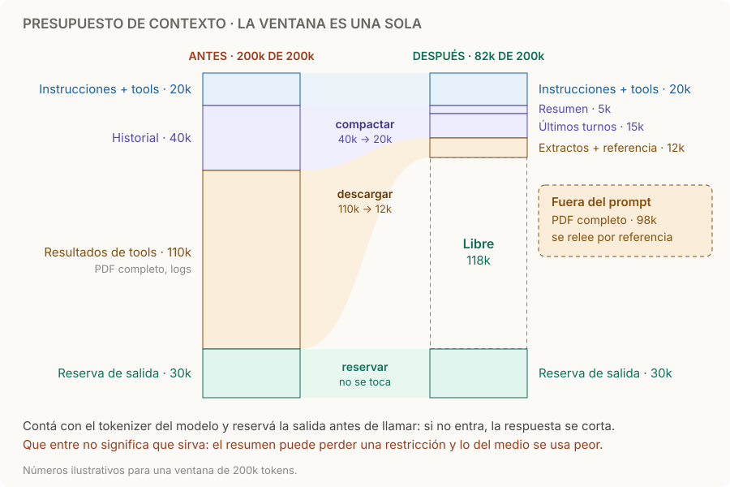

# Presupuesto de contexto

> **En una frase:** instrucciones, tools, historial, resultados y la respuesta comparten una sola ventana; contá antes de llamar y liberá espacio sin perder lo que la tarea necesita.

## Cómo funciona
1. **Todo suma.** System prompt, definiciones de tools, mensajes, resultados de tools, imágenes, PDF y la salida del turno, incluido el razonamiento. Los tokens cacheados también ocupan lugar: [[Prompt caching]] cambia cuánto pagás, no cuánto ocupa.
2. **Contá con el tokenizer del modelo.** El mismo texto da cifras distintas entre proveedores y entre versiones. Usá el conteo del proveedor (en Claude, `count_tokens`) y compará con `usage` de las respuestas reales. Contar caracteres o usar el tokenizer de otro proveedor da cifras equivocadas: `tiktoken`, por ejemplo, cuenta de menos en Claude, sobre todo en código y en español.
3. **Reservá la salida.** Si la entrada sola no entra, la API rechaza la llamada. Si entra, pero deja poco espacio, la respuesta se corta: en los modelos recientes de Claude termina con `model_context_window_exceeded`, distinto de `max_tokens`.
4. **Liberá antes de necesitarlo.** Con cuatro palancas: seleccionar, descargar, limpiar y compactar.

| Palanca | Qué hace | Qué puede salir mal |
|---|---|---|
| **Seleccionar** | Traer solo lo relevante: top-k de RAG, tools o instrucciones cargadas bajo demanda | Dejar afuera la evidencia que hacía falta |
| **Descargar** —offload— | Guardar el resultado grande fuera del prompt y pasar un extracto con una referencia | Una referencia que no se puede volver a leer, o que ignora permisos |
| **Limpiar** | Quitar resultados viejos de tools que ya se usaron | Borrar un dato que se iba a necesitar después |
| **Compactar** | Resumir el historial en decisiones, IDs, restricciones y pendientes | Un resumen que pierde una restricción o una aprobación |

En Claude, limpiar y compactar existen del lado del servidor (context editing y compaction, en beta). [Ventana de contexto](https://platform.claude.com/docs/en/build-with-claude/context-windows) · [Context editing](https://platform.claude.com/docs/en/build-with-claude/context-editing) · [Compaction](https://platform.claude.com/docs/en/build-with-claude/compaction).

## Ejemplo
Un agente de reclamos llega al turno 30 con la ventana llena: una tool devolvió el PDF completo de la póliza (110k) y el historial ya ocupa 40k.
- **Descargar:** el PDF queda en storage; al contexto pasan las tres páginas que importan y una referencia para releerlo con permisos.
- **Compactar:** los primeros 25 turnos se vuelven un resumen con número de póliza, cobertura confirmada, “no llamar por teléfono” y reembolso pendiente de aprobación. Los últimos turnos quedan completos.

Resultado: 82k de 200k, con la salida reservada. Números ilustrativos, los mismos del diagrama.

## Qué palanca usar
| Situación | Palanca |
|---|---|
| Una tool devuelve algo enorme: PDF, logs, una tabla | Descargar |
| Muchos turnos con resultados de tools ya usados | Limpiar |
| La conversación se acerca al límite y hay que seguir | Compactar |
| Hay 80 tools y cada tarea usa 3 | Seleccionar: cargar tools bajo demanda |
| Terminó una tarea y empieza otra | Contexto nuevo con un resumen; no arrastrar todo |

## Trampas
- **Que entre no significa que sirva.** Con más tokens, la precisión y el recall bajan (*context rot*), y lo que queda en el medio se usa peor: [[Lost in the middle]]. Una ventana de 1M no elimina el problema.
- **El resumen pierde lo crítico.** Soltar “no llamar por teléfono” o convertir “reembolso propuesto” en “reembolso hecho” rompe la tarea. Probalo con casos multi-turno: [[Golden cases agénticos]].
- **Limpiar o compactar rompe la caché.** Reescribir el historial invalida [[Prompt caching]] desde ese punto. Liberá en lotes grandes, no un poco en cada turno; por eso context editing tiene `clear_at_least`.
- **Descargar sin permisos.** La referencia se relee más tarde y debe pasar por los mismos controles: [[ACLs]] y [[Seguridad y evidencia documental]].
- **Cambiar de modelo cambia la cuenta.** Otro tokenizer u otra ventana puede hacer que el mismo historial ya no entre: [[Resiliencia entre proveedores]].

> [!TIP] Para recordar
> **Contá, reservá, liberá, y comprobá que lo importante sobrevivió.**

## Practicá
> [!question]- ¿Qué información nunca eliminarías al resumir una ejecución pendiente de aprobación?
> La acción propuesta exacta (qué, sobre qué recurso y con qué argumentos), que **todavía no se ejecutó**, quién debe aprobarla, los IDs y la clave de idempotencia, las restricciones del usuario y las referencias a la evidencia. Si el resumen dice “se canceló el pedido” en lugar de “cancelación propuesta, esperando aprobación”, el agente puede actuar dos veces o nunca. Ver [[Control humano y permisos]] y [[Ejecución y recuperación]].

> [!question]- Ventana de 200k. Instrucciones y tools ocupan 20k, el historial 60k y reservás 16k de salida. Una tool va a devolver un log de 120k. ¿Entra? ¿Qué hacés?
> No entra: 20 + 60 + 120 + 16 = 216k. Aunque entrara, pondría el log entero en contexto. Descargalo: guardá el log y pasá solo las líneas con error, por ejemplo 3k, con una referencia. Queda 20 + 60 + 3 + 16 = 99k.

> [!question]- Tu agente compacta un poco en cada turno para mantenerse en 50k, y la factura subió. ¿Por qué?
> Cada compactación reescribe el historial y rompe la caché desde ese punto: cada turno vuelve a escribir (1,25×) en lugar de leer (0,1×). Conviene dejar crecer el contexto y compactar en lotes grandes, al pasar un umbral.

## Se conecta con
[[Contexto, memoria y estado]] · [[Prompt caching]] · [[Lost in the middle]] · [[Ejecución y recuperación]] · [[Resiliencia entre proveedores]] · [[Seguridad y evidencia documental]]
