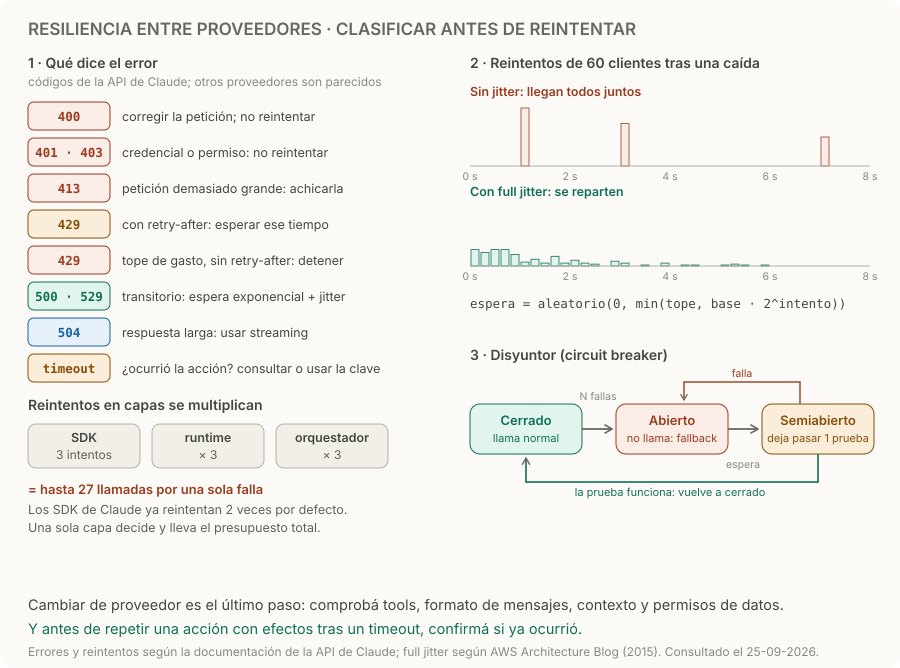

# Resiliencia entre proveedores

> **En una frase:** clasificá la falla antes de decidir si corregir, esperar o cambiar de proveedor.

## Cómo funciona
1. **Clasificar.** ¿La petición está mal, falta permiso, se alcanzó un límite, falló el proveedor o se cortó el tiempo? Solo lo transitorio se reintenta.
2. **Reintentar con espera exponencial y jitter.** Con *full jitter*, cada espera es `aleatorio(0, min(tope, base · 2^intento))`: sin la parte aleatoria, los clientes reintentan todos juntos y vuelven a saturar al proveedor. [Backoff y jitter](https://aws.amazon.com/blogs/architecture/exponential-backoff-and-jitter/). Si la respuesta trae `retry-after`, respetalo.
3. **Proteger.** Limitá intentos, concurrencia, tiempo total y gasto. Un disyuntor (*circuit breaker*) deja de llamar a un proveedor que falla seguido, espera y deja pasar una prueba antes de volver a la normalidad.
4. **Fallback compatible.** Otro modelo u otro proveedor, solo si soporta las mismas tools, el formato de mensajes, el tamaño de contexto y los permisos de datos. Medí su calidad con la misma eval: [[Regresiones y CI]].
5. **Timeout es resultado desconocido.** Antes de repetir una acción con efectos, comprobá si ya ocurrió: [[Ejecución y recuperación]].

Los SDK de Claude ya reintentan errores de conexión, 429 y 5xx: dos veces por defecto, con espera exponencial y respetando `retry-after`. Se configura con `max_retries`. [Errores de la API](https://platform.claude.com/docs/en/api/errors).

## Qué hacer con cada error
| Error en la API de Claude | Qué significa | Qué hacer |
|---|---|---|
| 400 `invalid_request_error` | Formato o contenido inválido; también, un límite de gasto que fijaste vos | Corregir; no reintentar |
| 401 · 403 | Clave inválida o sin permiso para el recurso | Revisar la credencial; no reintentar |
| 413 `request_too_large` | Supera el tamaño máximo (32 MB en Messages) | Achicar la petición |
| 429 con `retry-after` | Límite de tasa | Esperar el tiempo indicado |
| 429 sin `retry-after` | Tope de gasto mensual del tier | Detener y avisar: reintentar no sirve |
| 500 `api_error` · 529 `overloaded_error` | Falla interna o sobrecarga | Espera exponencial con jitter; fallback si persiste |
| 504 `timeout_error` | La petición tardó demasiado | Streaming o batches para respuestas largas |

Con streaming, un error puede llegar como evento después de un 200: [[Streaming y cancelación]].

## Ejemplo
Un esquema inválido necesita corrección: repetirlo diez veces solo consume recursos. Con un pico de 529, en cambio, conviene reintentar, pero no todos a la vez: si 60 agentes esperan 1, 2 y 4 s exactos, sus reintentos llegan juntos a los 1, 3 y 7 s y vuelven a saturar; con jitter se reparten. Si el proveedor sigue fallando, el disyuntor se abre y las tareas pasan al fallback o fallan rápido, con aviso. Números ilustrativos, los mismos del diagrama.

## Trampas
- **Reintentar lo que no es transitorio.** Un 400, un 401 o un tope de gasto fallan igual la segunda vez.
- **Reintentos en capas.** SDK, runtime y orquestador con 3 intentos cada uno pueden hacer 27 llamadas por una sola falla. Definí una capa responsable y un presupuesto total de tiempo.
- **Espera sin jitter.** Sincroniza los reintentos de todos los clientes.
- **Volver de golpe.** Un aumento brusco de uso puede dar 429 por límites de aceleración: subí el tráfico de a poco. [Límites](https://platform.claude.com/docs/en/api/rate-limits).
- **Fallback que cambia el resultado.** Otro modelo puede no soportar las mismas tools o formato, o no estar autorizado para esos datos.

> [!TIP] Para recordar
> **Clasificá primero; reintentá solo lo transitorio, con jitter y desde una sola capa; cambiá de proveedor solo si es compatible.**

## Practicá
> [!question]- ¿Qué conservarías al cambiar de proveedor a mitad de una ejecución?
> El estado de la tarea: IDs, decisiones y restricciones, resultados de tools ya ejecutadas con sus claves de idempotencia, qué acciones están hechas o pendientes, y el presupuesto consumido. Adaptá mensajes y definiciones de tools al formato del nuevo proveedor y volvé a contar tokens: otro tokenizer u otra ventana puede hacer que el mismo historial no entre ([[Presupuesto de contexto]]). No arrastres lo que solo entiende el proveedor anterior, como su caché o sus bloques de razonamiento. Y comprobá que el nuevo proveedor esté autorizado para esos datos.

> [!question]- Recibís 429, el SDK reintenta dos veces y todo sigue fallando durante horas. ¿Qué está pasando?
> Probablemente no es un límite de tasa sino el tope de gasto mensual del tier. La respuesta es un 429 `rate_limit_error`, pero sin `retry-after`, y en Messages trae `error.details.error_code` igual a `enforced_spend_limit_reached`. Reintentar no sirve: el acceso vuelve el primer día del mes siguiente o al subir de tier. Detectalo por ese código, cortá los reintentos y alertá a quien administra la cuenta.

> [!question]- El SDK hace 3 intentos, el runtime hasta 5 y el orquestador hasta 3 por tarea. ¿Cuántas llamadas puede generar una falla persistente, y qué cambiás?
> Hasta 3 × 5 × 3 = 45 llamadas, con esperas que se suman y pueden pasar de minutos. Elegí una sola capa responsable: por ejemplo, dejá que reintente el SDK y poné `max_retries` en 0 donde no corresponda, o al revés. Fijá además un presupuesto total de tiempo y de intentos por tarea, y registrá cada intento en la traza: [[Trazas y debugging]].

## Se conecta con
[[Ejecución y recuperación]] · [[Streaming y cancelación]] · [[Presupuesto de contexto]] · [[Despliegue y operación bajo carga]] · [[Trazas y debugging]] · [[Evals por cliente y producción]]
