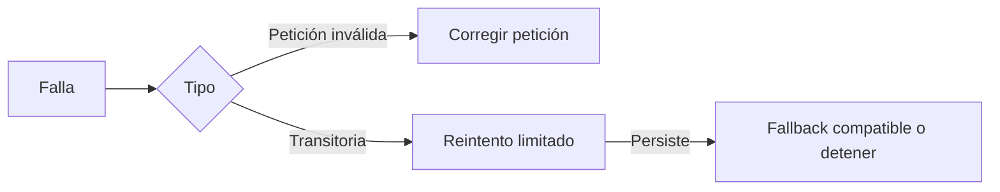

# Resiliencia entre proveedores

> **En una frase:** clasificá la falla antes de decidir si corregir, esperar o cambiar de proveedor.

## Tres ideas
- **Reintentos:** para fallas transitorias, usá espera creciente y variación aleatoria —backoff y jitter—; respetá la espera indicada por el proveedor.
- **Protección:** limitá intentos, concurrencia, tiempo total y gasto. Un circuit breaker pausa llamadas a un proveedor que falla repetidamente.
- **Fallback:** verificá compatibilidad de tools, mensajes, contexto y permisos de datos. Medí también si cambia la calidad.

**Ejemplo:** un esquema inválido necesita corrección; repetirlo diez veces solo consume recursos. Un timeout exige además revisar posibles efectos ya ejecutados.

> [!TIP] Para recordar
> Los reintentos del SDK y del runtime pueden multiplicarse. Definí quién controla el presupuesto total.

**Practicá:** ¿qué conservarías al cambiar de proveedor a mitad de una ejecución?

[[Presupuesto de contexto]] · [[Evals por cliente y producción]]
