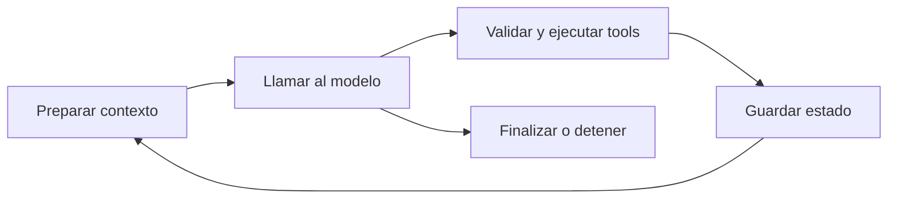

# Runtime de agentes

> **En una frase:** controlar la ejecución, reutilizar trabajo válido y operar el sistema con usuarios reales.



## Tres bloques
| Bloque | Recorrido |
|---|---|
| **Ejecución** | [[Presupuesto de contexto]] → [[Ejecución y recuperación]]; después [[Streaming y cancelación]] y [[Resiliencia entre proveedores]] |
| **Caché** | [[Caché en agentes]] → claves e invalidación → elegir entre prompts, respuestas o ingesta/búsqueda |
| **Operación** | [[Trazas y debugging]] → [[Operación en producción]] → [[Despliegue y operación bajo carga]] |

Las capas de caché comparten reglas de validez, pero no forman un pipeline. Tienen su [[Caché.canvas|sub-mapa de Caché]] para no mezclar sus detalles con la ejecución.

## Conexiones con otras categorías
[[Seguridad]] define permisos y aislamiento. [[Evals]] mide calidad y regresiones: [[Regresiones y CI]] antes de publicar, [[Evals por cliente y producción]] durante el uso real. Operar pertenece aquí; evaluar pertenece a Evals.

**Practicá:** explicá una falla, cómo la encontraste en las trazas y cómo comprobaste la recuperación.

## Estado de los nodos
```dataview
TABLE WITHOUT ID file.link AS nodo, bloque, estado
FROM "runtime"
WHERE file.name != "Runtime de agentes" AND (file.folder = "runtime" OR file.name = "Caché en agentes")
SORT orden
```

[[Runtime de agentes.canvas|Abrir el canvas de Runtime]] · [[Subagents y Deep Agents]]

Para integraciones distribuidas: [[MCP stateless y estado]] distingue estado del protocolo, conversación y persistencia de negocio.
