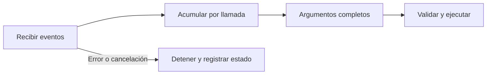

# Streaming y cancelación

> **En una frase:** recibir fragmentos no equivale a completar una respuesta; cancelar no deshace lo ejecutado.

## Tres ideas
- **Fragmentos:** los argumentos de una tool pueden llegar incompletos. Esperá su cierre y validalos antes de actuar.
- **Interrupciones:** un stream puede fallar después de empezar. Diferenciá respuesta parcial, finalizada y fallida.
- **Cancelación:** propagá la señal al proveedor y las tools que la soporten; dejá de iniciar trabajo y registrá las acciones ya realizadas.

**Ejemplo:** el usuario cancela mientras se prepara una cotización. La ejecución se detiene, pero una escritura ya confirmada necesita una acción aparte si corresponde revertirla.

> [!TIP] Para recordar
> En TypeScript, estudiá cómo propagar `AbortSignal` a lo largo de la ejecución.

## Practicá
> [!question]- ¿Qué mostrarías al usuario si recibió media respuesta y se cortó la conexión?
> Que la respuesta quedó incompleta, sin presentarla como terminada: conservá el texto recibido marcado como parcial y ofrecé reintentar. Si en ese turno se ejecutaron tools, decí cuáles terminaron y cuáles no, por ejemplo “la cotización se creó; el resumen quedó a medias”. Al reintentar, no repitas las acciones confirmadas: retomá desde el estado guardado, con [[Ejecución y recuperación|idempotencia]]. Y si el corte llegó en medio de los argumentos de una tool, no la ejecutes: están incompletos.

## Se conecta con
[[Resiliencia entre proveedores]] · [[Ejecución y recuperación]]
