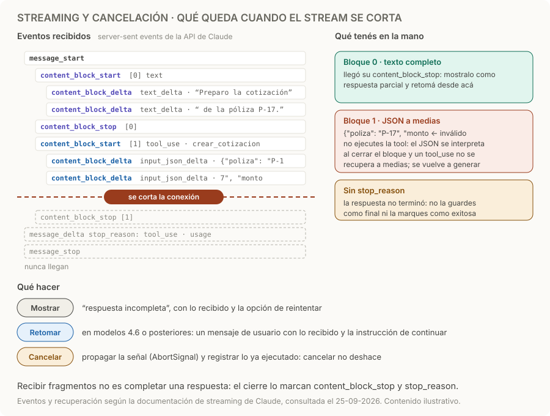

# Streaming y cancelación

> **En una frase:** recibir fragmentos no equivale a completar una respuesta; cancelar no deshace lo ejecutado.

## Cómo funciona
1. **Un orden fijo de eventos.** En la API de Claude: `message_start`; después cada bloque de contenido con `content_block_start`, sus fragmentos (`content_block_delta`) y `content_block_stop`; al final, `message_delta` con el `stop_reason` y el uso acumulado, y `message_stop`. En el medio pueden llegar `ping` y, en el futuro, tipos nuevos que tu código debe ignorar sin romperse. [Streaming](https://platform.claude.com/docs/en/build-with-claude/streaming).
2. **Texto y argumentos llegan distinto.** El texto llega en `text_delta` y se puede mostrar a medida que llega. Los argumentos de una tool llegan como fragmentos de JSON (`input_json_delta`) que por separado no son válidos: se acumulan y se interpretan al recibir `content_block_stop`.
3. **Los errores pueden llegar tarde.** Un stream puede fallar después de responder 200, con un evento `error`, por ejemplo `overloaded_error`, o con la conexión cortada. Diferenciá respuesta completa, parcial y fallida.
4. **Retomar.** Guardá lo recibido. En modelos 4.6 o posteriores, se retoma con un mensaje de usuario que incluye la respuesta parcial y pide continuar. Los bloques de tool y de razonamiento no se recuperan a medias: se retoma desde el último bloque de texto.
5. **Cancelar.** Propagá la señal al proveedor y a las tools que la soporten, dejá de iniciar trabajo y registrá lo que ya se hizo. En TypeScript, eso es pasar un `AbortSignal` a lo largo de toda la ejecución.

## Ejemplo
El agente empieza a responder “Preparo la cotización de la póliza P-17.” y abre un bloque `tool_use` para `crear_cotizacion`. Llegan dos fragmentos de argumentos y se corta la conexión. El bloque de texto está completo y se muestra como respuesta parcial; el JSON quedó en `{"poliza": "P-17", "monto`, así que la tool no se ejecuta. Como nunca llegó el `stop_reason`, la respuesta no se guarda como final. Contenido ilustrativo, el mismo del diagrama.

## Trampas
- **Ejecutar con argumentos incompletos.** Nunca antes de `content_block_stop`, aunque un parser de JSON parcial ya muestre algo.
- **Tratar el 200 como éxito.** El estado HTTP llega antes que el contenido: el éxito lo marca un stream que termina con `stop_reason`.
- **Reintentar todo después de un corte.** Si una tool ya se ejecutó en ese turno, repetir el turno la repite: [[Ejecución y recuperación]].
- **Cancelar solo la interfaz.** Si el backend sigue corriendo, sigue gastando y actuando: la señal tiene que llegar a cada llamada.
- **Creer que cancelar deshace.** Una escritura confirmada necesita una acción compensatoria aparte.

> [!TIP] Para recordar
> **Mostrá texto a medida que llega; ejecutá tools solo con el bloque cerrado; la respuesta termina con `stop_reason`, no con el primer byte.**

## Practicá
> [!question]- ¿Qué mostrarías al usuario si recibió media respuesta y se cortó la conexión?
> Que la respuesta quedó incompleta, sin presentarla como terminada: conservá el texto recibido marcado como parcial y ofrecé reintentar. Si en ese turno se ejecutaron tools, decí cuáles terminaron y cuáles no, por ejemplo “la cotización se creó; el resumen quedó a medias”. Al reintentar, no repitas las acciones confirmadas: retomá desde el estado guardado, con [[Ejecución y recuperación|idempotencia]]. Y si el corte llegó en medio de los argumentos de una tool, no la ejecutes: están incompletos.

> [!question]- El stream termina bien, pero tu código falla a veces al leer los argumentos de una tool. ¿Qué pasa?
> Probablemente los interpretás antes de tiempo: cada `input_json_delta` trae un pedazo de JSON que solo es válido al juntarlo con el resto. Acumulá los fragmentos por índice de bloque y parseá al recibir `content_block_stop`, o usá el helper del SDK que arma el mensaje final. Para mostrar progreso antes del cierre sirve un parser de JSON parcial, pero no para ejecutar.

> [!question]- El usuario cancela mientras el agente crea una cotización y envía un email. ¿Qué garantiza la cancelación?
> Que no se inicien pasos nuevos y que se corten las llamadas que soportan la señal. No deshace lo confirmado: si la cotización ya se creó, sigue existiendo, y un email enviado no vuelve. Registrá qué terminó y qué no, informáselo al usuario y, si corresponde, ejecutá aparte una acción compensatoria, como anular la cotización, con aprobación: [[Control humano y permisos]].

## Se conecta con
[[Resiliencia entre proveedores]] · [[Ejecución y recuperación]] · [[Tools y function calling]] · [[Trazas y debugging]] · [[Control humano y permisos]]
