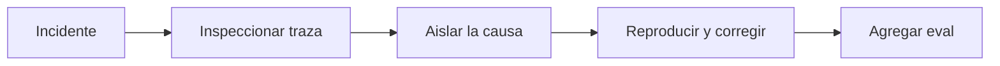

# Trazas y debugging

> **En una frase:** encontrá el primer paso incorrecto y convertí esa falla en un caso de regresión.

## Tres ideas
- **Registrar:** relacioná ejecución, cliente, versiones, llamadas, errores y resultados. Medí tokens, costo total y latencia por etapa; protegé datos sensibles.
- **Aislar:** distinguí decisión del modelo, error del runtime, falla de tool y falla del proveedor. Buscá dónde empieza la desviación.
- **Reproducir:** usá respuestas grabadas de tools e inyectá timeouts, esquemas inválidos o desconexiones. Repetí ensayos cuando intervenga el modelo.

**Ejemplo:** sube la latencia p95 —el valor bajo el que cae el 95% de las mediciones—. La traza muestra que el tiempo extra está en reintentos de una tool.

> [!TIP] Para recordar
> Un replay con respuestas grabadas ayuda a aislar fallas; no garantiza repetir la misma salida del modelo.

## Practicá
> [!question]- ¿Qué evidencia pedirías para investigar una falla que ocurre una vez cada cien ejecuciones?
> Trazas completas de las ejecuciones que fallaron y de una muestra de las que no, para compararlas: versiones de prompt, modelo, tools e índice, cliente, entradas, llamadas con argumentos y resultados, errores, reintentos y tiempos. Buscá qué comparten las fallidas: un cliente, un tipo de documento, un proveedor, un timeout, la concurrencia. Para reproducirla, grabá las respuestas de las tools de una ejecución fallida y repetí muchos ensayos: con una tasa del 1 %, necesitás cientos para verla varias veces. Protegé los datos sensibles de esas trazas.

## Se conecta con
[[Operación en producción]] · [[Golden dataset]]
