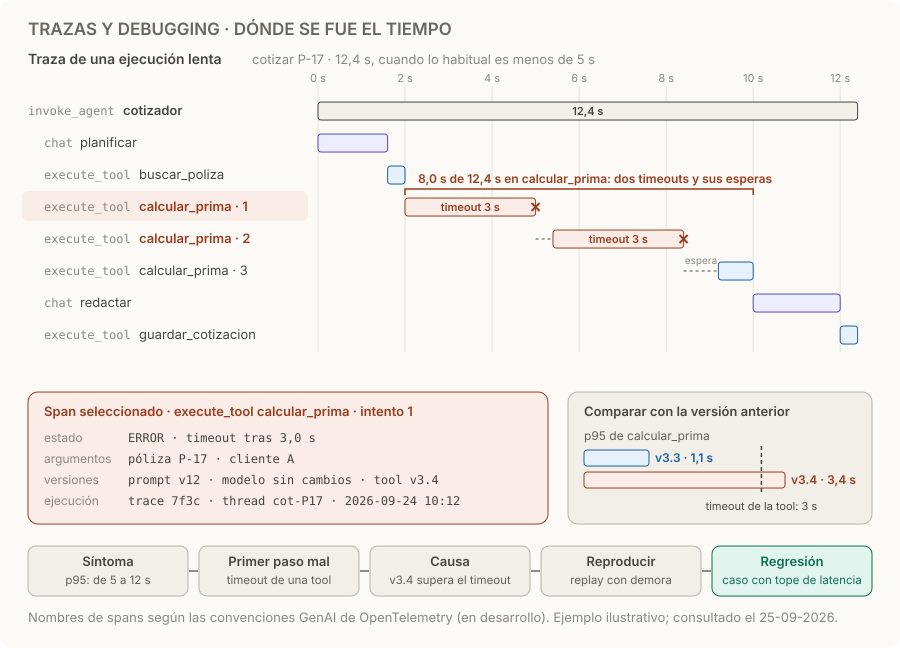

# Trazas y debugging

> **En una frase:** encontrá el primer paso incorrecto y convertí esa falla en un caso de regresión.

## Cómo funciona
1. **Una traza por ejecución.** Reúne todo lo que hizo el agente para responder: cada llamada al modelo, cada tool y cada reintento. En LangSmith, cada unidad de trabajo es un *run*, la traza agrupa los runs de una operación y un *thread* agrupa las trazas de una conversación de varios turnos. [Conceptos de observabilidad](https://docs.langchain.com/langsmith/observability-concepts).
2. **Cada paso es un span con atributos.** Qué operación fue, cuándo empezó, cuánto duró, si falló, con qué argumentos y con qué versiones de prompt, modelo, tools e índice. En las llamadas al modelo, también tokens y costo.
3. **Leer de arriba hacia abajo.** Buscá el primer paso que se desvía: una decisión del modelo, un error del runtime, una tool que falla o el proveedor. Lo que viene después suele ser consecuencia.
4. **Comparar.** Con una traza sana del mismo caso y con la versión anterior. El p95 —el valor bajo el que cae el 95 % de las mediciones— dice que algo cambió; la traza dice dónde.
5. **Reproducir y fijar.** Un replay con respuestas grabadas de tools e inyección de fallas: timeouts, esquemas inválidos, desconexiones. La falla se vuelve un caso de [[Regresiones y CI]].

OpenTelemetry tiene convenciones para IA generativa: spans `chat {modelo}` para llamadas al modelo, `execute_tool {tool}` para tools e `invoke_agent {agente}` para agentes, con atributos como `gen_ai.request.model` y `gen_ai.usage.input_tokens`. Todavía están en desarrollo, y registrar el contenido de los mensajes es opcional porque puede tener datos sensibles. [Convenciones GenAI](https://github.com/open-telemetry/semantic-conventions-genai).

## Qué registrar
| Dato | Para qué |
|---|---|
| IDs de ejecución, conversación y cliente | Encontrar la traza de un reclamo y agrupar por cliente |
| Versiones de prompt, modelo, tools e índice | Saber qué cambió entre una traza sana y una rota |
| Por span: operación, inicio, duración, estado y error | Ver dónde se fue el tiempo y qué falló primero |
| Argumentos y resultados de tools | Reproducir con las mismas entradas |
| Tokens, costo e intentos | Costo por tarea y reintentos que no se ven en el resultado |
| Contenido de los mensajes | Solo si hace falta y protegido: puede tener datos personales |

## Ejemplo
La latencia p95 del cotizador sube de 5 a 12 s. En la traza de una ejecución lenta, el modelo no cambió: `calcular_prima` venció dos veces por timeout de 3 s y el runtime reintentó con espera, así que esa tool se llevó 8,0 de los 12,4 s. Comparando versiones, la tool v3.4 pasó de 1,1 a 3,4 s en p95. Se reproduce con un replay que inyecta esa demora, y el caso entra a CI con un tope de latencia. Números ilustrativos, los mismos del diagrama.

## Trampas
- **Arreglar el último error.** El último error suele ser consecuencia del primero. En el ejemplo, la respuesta tardía es el síntoma; el timeout de la tool es el primer paso incorrecto.
- **Solo métricas, sin trazas.** Un p95 dice que algo empeoró, no dónde. Guardá trazas completas de las ejecuciones lentas y fallidas, y una muestra de las normales para comparar.
- **Sumar dos veces.** En trazas anidadas, el costo del padre ya incluye a los hijos: sumá solo en las llamadas al modelo. La duración del padre es tiempo real; no sumes ramas que corrieron en paralelo.
- **Secretos en los atributos.** Tokens, credenciales y datos personales no deben llegar a la traza; filtralos antes de exportar: [[Seguridad y evidencia documental]].
- **Replay no es determinismo.** Grabar las respuestas de las tools aísla la falla, pero el modelo puede responder distinto: repetí ensayos.

> [!TIP] Para recordar
> **Primero dónde, después por qué: el primer span que se desvía, comparado con una traza sana.**

## Practicá
> [!question]- ¿Qué evidencia pedirías para investigar una falla que ocurre una vez cada cien ejecuciones?
> Trazas completas de las ejecuciones que fallaron y de una muestra de las que no, para compararlas: versiones de prompt, modelo, tools e índice, cliente, entradas, llamadas con argumentos y resultados, errores, reintentos y tiempos. Buscá qué comparten las fallidas: un cliente, un tipo de documento, un proveedor, un timeout, la concurrencia. Para reproducirla, grabá las respuestas de las tools de una ejecución fallida y repetí muchos ensayos: con una tasa del 1 %, necesitás cientos para verla varias veces. Protegé los datos sensibles de esas trazas.

> [!question]- En el ejemplo, ¿por qué subir el timeout de `calcular_prima` a 5 s no alcanza como arreglo?
> Porque tapa el síntoma: sin reintentos, la tool sigue tardando 3,4 s en p95 y el agente queda más lento que antes. El arreglo apunta a la causa: investigar por qué la v3.4 se volvió más lenta o volver a la v3.3. Además, fijá un presupuesto total de tiempo para los reintentos, con una sola capa que reintente ([[Resiliencia entre proveedores]]), y sumá el caso a CI con un tope de latencia.

> [!question]- El costo total de tus trazas da el doble de lo que facturó el proveedor. ¿Qué revisás?
> Que no estés sumando el mismo costo en dos niveles: el span del agente ya agrega el costo de sus hijos, y si lo sumás junto con las llamadas al modelo lo contás dos veces. Sumá solo en las llamadas al modelo y compará con el `usage` de sus respuestas. Revisá también que los tokens cacheados se estén valorando con su precio, no con el de entrada normal: [[Prompt caching]].

## Se conecta con
[[Operación en producción]] · [[Regresiones y CI]] · [[Ejecución y recuperación]] · [[Resiliencia entre proveedores]] · [[Evals por cliente y producción]] · [[Golden dataset]]
