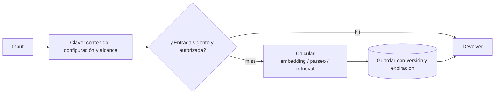

# Caché de ingesta y búsqueda

> **En una frase:** reutilizá resultados de ingesta y búsqueda mientras coincidan contenido, configuración y permisos.

## Diagrama

## Qué cachear
| Capa | Key | TTL | Ahorra |
|---|---|---|---|
| Embeddings | `hash(input, modelo, versión, dimensiones, modo, preprocesamiento)` | Mientras coincidan el contenido y toda la configuración | Casi todo el costo de re-ingesta |
| Retrieval | Query, filtros, versión del índice, cliente y alcance de acceso | Según frescura requerida; invalidar cambios | Búsquedas repetidas |
| Parseo / OCR | Hash del archivo, versión del parser y opciones; alcance | Hasta cambiar alguna dependencia | Relectura del mismo documento |

## Reglas
- Cambiar modelo, contenido o preprocesamiento requiere otra entrada de embeddings.
- Con [[Incremental sync]] + cache de embeddings, re-sincronizar cuesta solo lo que cambió.
- Aplicá [[ACLs]] también en hits; un permiso revocado no espera al TTL.

> [!TIP] Otras capas
> [[Caché en agentes]] compara [[Prompt caching]] y [[Caché de respuestas]]. Elegí según costo medido, repetición y riesgo de desactualización.
