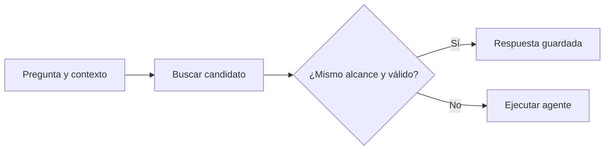

# Caché de respuestas

> **En una frase:** devolvés una respuesta anterior sin volver a generar, si todavía sirve para la petición actual.

## Exacto o semántico
| Tipo | Cómo busca | Riesgo |
|---|---|---|
| Exacto | Coincidencia de clave con todas las dependencias | Una clave incompleta mezcla contextos |
| Semántico | Embedding y umbral de similitud, dentro del alcance autorizado | Preguntas parecidas pueden necesitar respuestas diferentes |

**Ejemplo:** “¿cubre inundaciones?” y “¿excluye inundaciones?” pueden parecerse mucho. Un score vectorial alto no prueba que puedas intercambiar sus respuestas.

## Cuándo usarlo
- Buen candidato: FAQ estable, con fuentes y versiones conocidas.
- Evitalo si falta contexto de conversación, cambian datos esenciales o la tarea exige ejecutar una acción nueva.
- En caché semántica, filtrá cliente, permisos y versiones antes de buscar; calibrá el umbral con pares que sí y que no admitan la misma respuesta. No hay un umbral universal.

**Qué guardar:** respuesta, evidencia y metadatos de validez. Para búsqueda semántica, también representación de la pregunta e índice de embeddings versionado. Protegé texto y vectores como datos del usuario.

No hace falta `temperature=0` para cachear; tampoco garantiza determinismo. Reutilizar una salida reduce deliberadamente la variedad.

## Practicá
> [!question]- ¿Qué debería pasar si la pregunta es idéntica pero cambió el documento?
> Tiene que ser un miss. La versión del documento forma parte de la clave, así que la versión nueva produce otra clave y el agente vuelve a responder. Además, al publicarse el documento nuevo, invalidá las respuestas que dependían del anterior sin esperar el TTL. Si la clave es solo el texto de la pregunta, el usuario recibe la respuesta vieja como si fuera vigente: [[Claves e invalidación de caché]].
