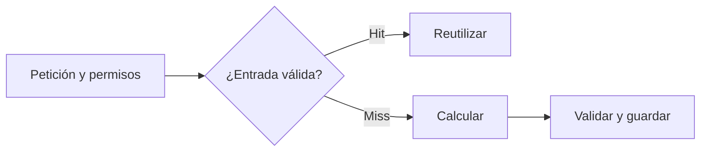

# Caché en agentes

> **En una frase:** reutilizá trabajo anterior solo cuando siga siendo válido para esta petición.



## Cuatro capas
| Capa | Qué reutiliza | Ejemplo |
|---|---|---|
| [[Prompt caching]] | Procesamiento de contexto en el proveedor | Mismo documento, nuevas preguntas |
| [[Caché de respuestas]] | Una respuesta ya generada | Pregunta repetida bajo el mismo contexto |
| Tools de lectura | Datos o cálculos previos | Texto de un PDF, identificado por su hash y versión del parser |
| [[Caché de ingesta y búsqueda]] | Embeddings y resultados de búsqueda | No recalcular lo que no cambió |

**Una pregunta sola no es una clave suficiente:** “¿cuál es el límite?” cambia según póliza, endoso, usuario e historial.

## Qué conviene guardar
Resultados reutilizables, costosos y verificables. Para tools, incluí argumentos y versión de los datos. En datos vivos, consultá de nuevo cuando la tarea requiera actualidad.

**No confundas caché con memoria ni estado durable:** debería poder descartarse y reconstruirse. Un “enviado” cacheado no demuestra que se ejecutó una nueva acción; para reintentos de escrituras usá [[Ejecución y recuperación|idempotencia]].

## Practicá
> [!question]- ¿Qué reutilizarías al hacer cinco preguntas distintas sobre el mismo PDF?
> Todo lo que depende del PDF y no de la pregunta. El texto extraído, cacheado por el hash del PDF y la versión del parser, para no procesarlo cinco veces. El prefijo con el documento, con [[Prompt caching]]: la primera pregunta escribe la caché y las siguientes la leen. Los embeddings de sus chunks, si buscás dentro del PDF. La caché de respuestas no sirve: las preguntas son distintas.

## Orden de lectura
Primero [[Claves e invalidación de caché]]. Después elegí la capa: [[Prompt caching]], [[Caché de respuestas]] o [[Caché de ingesta y búsqueda]]. Son alternativas de reutilización, no pasos consecutivos.

Las comprobaciones siguen en [[Evals de caché]]. La ingesta y el retrieval siguen en [[RAG]].

## Estado de los nodos
```dataview
TABLE WITHOUT ID file.link AS nodo, estado
FROM "runtime/cache" WHERE tipo != "mapa" SORT orden
```

[[Caché.canvas|Abrir el sub-mapa de Caché]] · [[Runtime de agentes]]
