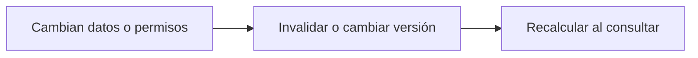

# Claves e invalidación de caché

> **En una frase:** definí a quién pertenece cada entrada, de qué depende y cuándo deja de servir.

## Ficha mínima de una respuesta
| Guardar | Para qué |
|---|---|
| Cliente y alcance de acceso; usuario/sesión si aplica | Aislar resultados |
| Hash de pregunta + historial relevante + documentos/versiones | Identificar el contexto real |
| Versiones de prompt, modelo, configuración y tools | Evitar reutilizar salidas de otra configuración |
| Respuesta y referencias de evidencia | Verificar su origen |
| Creación, expiración y dependencias | Invalidar y auditar |

La clave deriva de esos factores con una serialización estable. **Un hash no cifra ni anonimiza datos sensibles.**

## Tres reglas
- **TTL es duración, no garantía de actualidad.** Un endoso nuevo invalida respuestas anteriores aunque falten diez minutos para expirar.
- **Revalidá permisos al servir.** Separar por cliente no basta si dos usuarios tienen accesos distintos. Revocaciones y borrados deben alcanzar las entradas derivadas.
- **Guardá lo mínimo.** Excluí contraseñas, tokens, secretos y datos innecesarios; protegé el contenido sensible indispensable con acceso restringido, cifrado y retención definida. Evitá registrar prompts completos en logs por defecto.

No publiques como éxitos respuestas parciales o errores transitorios. Una escritura debe invalidar sus lecturas dependientes tras confirmarse; una caché vacía debería permitir recalcular.

**Practicá:** ¿cómo impedirías que una cotización anterior reaparezca después de actualizar la póliza?
