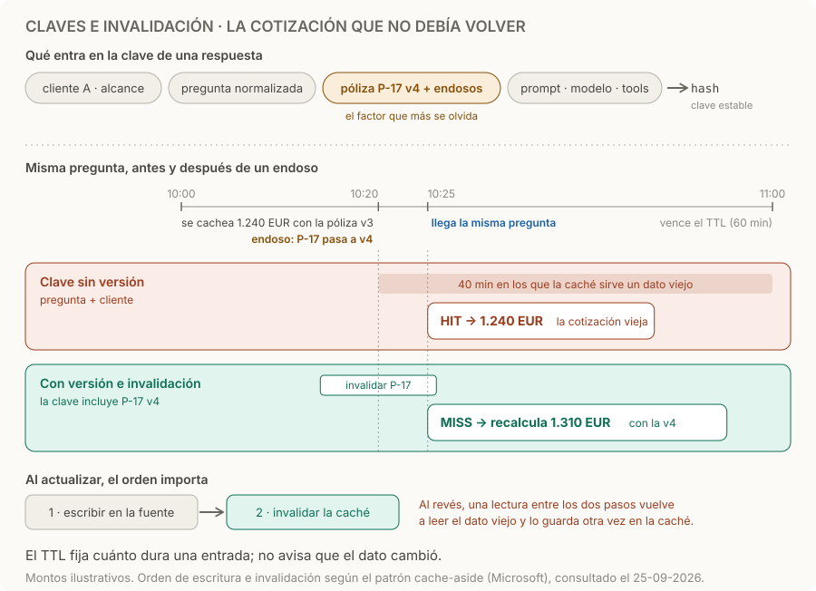

# Claves e invalidación de caché

> **En una frase:** definí a quién pertenece cada entrada, de qué depende y cuándo deja de servir.

## Cómo funciona
1. **La clave reúne todo aquello de lo que depende la respuesta.** Cliente y alcance de acceso, pregunta normalizada, historial relevante, documentos con su versión, y versiones de prompt, modelo, configuración y tools. Si falta un factor, dos contextos distintos comparten la misma entrada.
2. **Serialización estable.** Mismo orden de campos y mismos formatos de fechas, mayúsculas y espacios: lo mismo produce siempre la misma clave. El hash la identifica; **no cifra ni anonimiza** datos sensibles.
3. **Al leer, cache-aside.** Buscá la clave; si no está (*miss*), calculá, guardá y devolvé el resultado.
4. **Al escribir, primero la fuente y después invalidar.** Cuando se confirma el cambio, borrá las entradas que dependían de ese dato. Si invalidás antes, una lectura entre los dos pasos vuelve a leer el dato viejo y lo guarda otra vez. [Patrón cache-aside](https://learn.microsoft.com/es-es/azure/architecture/patterns/cache-aside).
5. **El TTL como red de seguridad.** Limita cuánto vive una entrada si una invalidación falla; no reemplaza invalidar ante un cambio que conocés.

Aun así, cache-aside no garantiza consistencia: entre la escritura y la siguiente lectura puede haber un momento con el dato viejo, y un proceso externo puede cambiar la fuente sin avisar. Donde eso no sea aceptable, revalidá la versión al servir.

## Ficha mínima de una respuesta
| Guardar | Para qué |
|---|---|
| Cliente y alcance de acceso; usuario o sesión si aplica | Aislar resultados |
| Hash de pregunta, historial relevante y documentos con versiones | Identificar el contexto real |
| Versiones de prompt, modelo, configuración y tools | No reutilizar salidas de otra configuración |
| Respuesta y referencias de evidencia | Verificar su origen |
| Creación, expiración y dependencias | Invalidar y auditar |

## Ejemplo
A las 10:00 se cachea una cotización de 1.240 EUR para la póliza P-17 en su versión 3. A las 10:20 un endoso la pasa a la versión 4, y a las 10:25 llega la misma pregunta. Si la clave es solo pregunta y cliente, hay un hit y la cotización vieja se sirve durante 40 minutos, hasta que vence el TTL. Con la versión en la clave, la consulta nueva es un miss y se recalcula: 1.310 EUR. Además, al confirmar el endoso se invalidaron las entradas de P-17. Montos ilustrativos, los mismos del diagrama.

## Trampas
- **Confiar en el TTL.** Es una duración, no una garantía de actualidad: un endoso nuevo invalida las respuestas anteriores aunque falten diez minutos para que expiren.
- **Invalidar antes de escribir.** Abre la ventana en la que una lectura vuelve a cachear el dato viejo.
- **Separar solo por cliente.** Dos usuarios del mismo cliente pueden tener accesos distintos: revalidá permisos al servir. Las revocaciones y los borrados deben alcanzar a las entradas derivadas: [[ACLs]].
- **Clave inestable.** Un timestamp, un ID de petición o un objeto serializado sin orden fijo dentro de la clave hacen que lo mismo genere claves distintas: nunca hay hits.
- **Cachear errores.** No guardes como éxito respuestas parciales o errores transitorios: se repetirían hasta que venzan.
- **Guardar de más.** Excluí contraseñas, tokens, secretos y datos innecesarios; protegé el contenido sensible indispensable con acceso restringido, cifrado y retención definida. Evitá registrar prompts completos en logs por defecto.

> [!TIP] Para recordar
> **Todo lo que cambia la respuesta va en la clave; todo cambio confirmado invalida lo que dependía de él.**

## Practicá
> [!question]- ¿Cómo impedirías que una cotización anterior reaparezca después de actualizar la póliza?
> Con tres controles juntos. En la clave, incluí la versión de la póliza y de sus endosos: la consulta nueva nunca coincide con la entrada anterior. Al escribir, cuando se confirma la actualización, invalidá las entradas que dependían de la póliza sin esperar el TTL. Al servir, comprobá que la versión guardada en la entrada sigue siendo la vigente; si no, recalculá. Como prueba de regresión: actualizá la póliza, repetí la pregunta y verificá que el monto cambie.

> [!question]- Los usuarios repiten la misma pregunta, pero el hit rate es 0 %. ¿Qué revisás?
> Que la clave sea estable. Generá la clave de dos peticiones iguales y compará campo por campo: suele colarse un timestamp, un ID de petición, el historial completo con IDs de mensaje, o un objeto serializado sin orden fijo. Revisá también que la pregunta se normalice (mayúsculas, espacios). Si el historial cambia en cada turno, incluí solo la parte que afecta la respuesta.

> [!question]- Un usuario pierde acceso a la póliza P-17 a las 10:30 y a las 10:31 pide una cotización que ya estaba cacheada para su cliente. ¿Qué debería pasar?
> No debería recibirla. La entrada sigue siendo válida para otros usuarios del cliente, pero al servir hay que revalidar los permisos de quien pregunta sobre sus dependencias, en este caso P-17. La revocación, además, debería invalidar o marcar las entradas derivadas. Separar la caché por cliente no alcanza: [[ACLs]] y [[Control humano y permisos]].

## Se conecta con
[[Caché en agentes]] · [[Caché de respuestas]] · [[Prompt caching]] · [[Caché de ingesta y búsqueda]] · [[Evals de caché]] · [[ACLs]]
