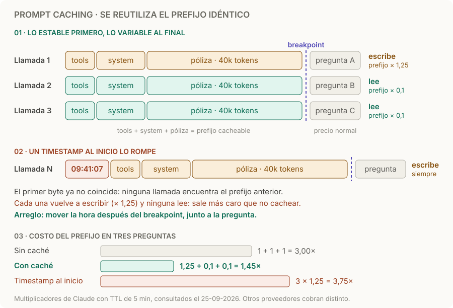

# Prompt caching

> **En una frase:** si una llamada empieza con exactamente los mismos tokens que otra reciente, el proveedor reutiliza el cómputo de ese prefijo; la respuesta se genera de nuevo.

## Cómo funciona
1. **Coincidencia exacta de prefijo.** La entrada se compara desde el primer token. Al primer byte distinto se corta la coincidencia; de ahí en adelante, todo se procesa de nuevo.
2. **Lo estable va primero.** Tools, instrucciones y documentos arriba; la pregunta, la fecha y los IDs de la request, al final. En Claude el orden es `tools → system → messages`.
3. **Breakpoint.** Marca hasta dónde guardar. Claude usa `cache_control` en un bloque (hasta 4) o caché automática; OpenAI cachea sin marcas y Gemini lo hace de forma implícita o con un recurso explícito.
4. **Vencimiento.** La entrada dura un TTL que cada lectura renueva. Claude: 5 minutos por defecto o 1 hora opcional.

## Cuánto cuesta en Claude
| Operación | Precio sobre el input normal |
|---|---|
| Escribir con TTL de 5 min | 1,25× |
| Escribir con TTL de 1 h | 2× |
| Leer | 0,1× |

Con 5 minutos, dos llamadas ya compensan: 1,25 + 0,1 = 1,35× contra 2× sin caché. Con 1 hora hacen falta tres: 2 + 0,1 + 0,1 = 2,2× contra 3×. Si el prefijo no llega al mínimo del modelo, entre 512 y 4.096 tokens, simplemente no se cachea y no hay error. [Prompt caching en Claude](https://platform.claude.com/docs/en/build-with-claude/prompt-caching).

## Cómo lo expone cada proveedor
| Proveedor | Cómo se activa | Dónde comprobarlo |
|---|---|---|
| Claude | `cache_control` por bloque, o automático en la request | `usage.cache_read_input_tokens` y `cache_creation_input_tokens` |
| OpenAI | Automático desde 1.024 tokens; `prompt_cache_key` opcional | `cached_tokens` en el detalle de tokens de entrada |
| Gemini | Implícito por defecto en modelos recientes; también recursos explícitos con ID y expiración | Tokens cacheados en la metadata de uso |

Consultado el **25-09-2026**. Mínimos, TTL y descuentos cambian por modelo; verificá antes de presupuestar. [OpenAI](https://developers.openai.com/api/docs/guides/prompt-caching) · [Gemini](https://docs.cloud.google.com/gemini-enterprise-agent-platform/models/context-cache/context-cache-overview).

## Ejemplo
Un asistente responde sobre una póliza de 40k tokens. Tools, instrucciones y póliza van primero, con el breakpoint al final de la póliza; cada pregunta va después. La primera llamada escribe y las siguientes, dentro del TTL, leen.

Si llega un endoso, cambia el texto de la póliza: el nuevo prefijo se escribe una vez y el viejo vence solo. Con un recurso explícito, en cambio, tenés que dejar de usar su ID o borrarlo.

**Qué guardás vos:** la plantilla versionada, las fuentes autorizadas y, si usás un recurso explícito, su ID, versión documental y expiración. El estado interno lo administra el proveedor; no se puede leer ni exportar.

## Cuándo sí / cuándo no
| Usalo cuando | No ayuda cuando |
|---|---|
| Muchas llamadas comparten un prefijo largo: system prompt, tools, documento o historial de un agente | El inicio cambia en cada llamada: pagás la escritura y nunca leés |
| Las llamadas llegan dentro del TTL, como un loop de agente o un chat activo | Pasan horas entre llamadas: la entrada vence antes de reutilizarse |
| Importa la latencia al primer token con contextos grandes | El prefijo no llega al mínimo de tokens del modelo |

## Trampas
- **Invalidadores silenciosos:** hora en el system prompt, UUIDs, `json.dumps` sin `sort_keys`, tools que cambian por usuario. La llamada funciona igual; solo sube la factura.
- **Cambiar de modelo o de tools** a mitad de conversación descarta lo cacheado: la caché es por modelo y las tools van al inicio.
- **Llamadas en paralelo:** en Claude, una entrada se puede leer recién cuando la primera respuesta empezó a llegar. Si lanzás N a la vez con el mismo prefijo, ninguna aprovecha a las otras.
- **No es memoria ni amplía la ventana:** el prefijo cacheado sigue ocupando contexto y sigue aplicando [[Lost in the middle]].
- **Hay que medirlo:** si `cache_read_input_tokens` queda en 0 con prefijos idénticos, algo cambia adelante. Compará dos requests consecutivas y dejá un test que falle si la segunda no lee → [[Evals de caché]].

> [!TIP] Para recordar
> **Estable arriba, variable abajo, y mirá los tokens leídos de caché.** Si no lo medís, no sabés si funciona.

## Practicá
> [!question]- ¿Por qué un timestamp al inicio puede arruinar el hit del prefijo?
> La caché compara desde el primer token. Si la hora cambia en cada llamada, la coincidencia se corta ahí y todo lo que viene después (instrucciones, documentos, historial) se procesa de nuevo. Además, con breakpoint, cada llamada paga la escritura (1,25×) y ninguna lee: sale más caro que no cachear. Arreglo: mover la hora después del breakpoint, junto a la pregunta.

> [!question]- Hacés 5 preguntas sobre el mismo PDF de 30k tokens, con 2 minutos entre cada una. ¿Qué TTL elegís y cuánto pagás por el prefijo?
> TTL de 5 minutos: cada lectura renueva el plazo, así que no llega a vencer. Prefijo: 1,25 + 4 × 0,1 = **1,65×**, contra 5× sin caché (un 67 % menos). Con TTL de 1 hora pagarías 2 + 0,4 = 2,4× sin ganar nada.

> [!question]- Un orquestador lanza 10 subagentes a la vez con el mismo system prompt largo. ¿Por qué ese primer lote no ahorra?
> En Claude, una entrada solo se puede leer cuando la primera respuesta empezó a llegar. Las 10 llamadas simultáneas pagan el prefijo completo por su cuenta. Mandá una, esperá su primer token y después lanzá las otras 9.

## Se conecta con
[[Caché en agentes]] · [[Claves e invalidación de caché]] · [[Caché de respuestas]] (reutiliza la respuesta, no el cómputo) · [[Presupuesto de contexto]] · [[Evals de caché]]
