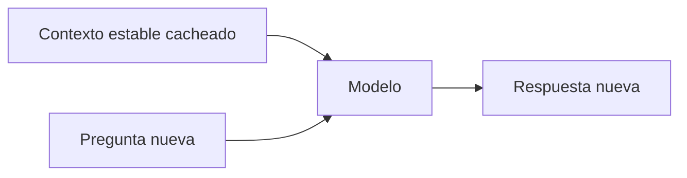

# Prompt caching

> **En una frase:** el proveedor reutiliza cómputo de una entrada repetida y el modelo genera una respuesta nueva.

## Cómo aprovecharlo
- **Prefijo estable:** conservá instrucciones, esquemas de tools y documentos idénticos al inicio; colocá la parte variable después, respetando la estructura de la API.
- **Gestión del proveedor:** puede ser implícita o requerir configuración. Claude permite marcar bloques; Gemini ofrece caché implícita y recursos explícitos referenciables por ID.
- **Comprobar:** mirá tokens cacheados, costo y latencia. Los mínimos de tokens, duración y cobros dependen del modelo y proveedor; una llamada repetida no garantiza hit.

## Qué guardás vos
La plantilla versionada y las fuentes autorizadas; si la API crea un recurso explícito, su ID, versión documental y expiración. El estado interno de inferencia lo administra el proveedor.

**Ejemplo:** reutilizás el contexto de una póliza para preguntar por límites y exclusiones. Si llega un endoso, actualizás el contexto; no seguís usando un recurso viejo.

> [!TIP] Para recordar
> Reduce procesamiento de entrada; no amplía la ventana ni garantiza recordar cada detalle. Sigue aplicando [[Lost in the middle]].

**Practicá:** ¿por qué un timestamp al inicio puede arruinar el hit del prefijo?

[[Caché de respuestas]] · [[Evals de caché]]
