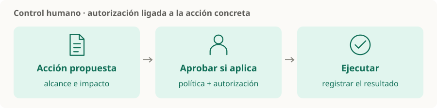

# Control humano y permisos

> **En una frase:** cada acción necesita permisos adecuados; las que requieren intervención humana se presentan con sus efectos antes de ejecutarlas.

## Tres preguntas
| Pregunta | Decisión |
|---|---|
| ¿Qué puede leer o modificar? | Permisos mínimos para la tarea y el usuario |
| ¿Cuándo puede actuar solo? | Política según impacto, reversibilidad y autorización existente |
| ¿Qué debe confirmar una persona? | Acción concreta, destino, datos y consecuencias |

**Ejemplo:** buscar un pedido puede ser automático; emitir un reembolso puede requerir aprobación según el rol del usuario y la política del sistema.

## Recordatorios
- La autorización se aplica en la herramienta o servicio; escribirla en el prompt no alcanza.
- La aprobación corresponde a una acción concreta. Si cambian sus datos o su alcance, comprobá que siga siendo válida.
- Registrá quién autorizó y qué ocurrió. Las trazas también deben proteger datos sensibles.
- Si falta información, pedí aclaración; si la acción no está permitida, no la ejecutes.

> [!TIP] Para recordar
> [[ACLs]] controla lectura de documentos. Las tools también necesitan permisos para actuar.

[[Tools y function calling]] · [[Guardrails]] · [[Operación en producción]]
