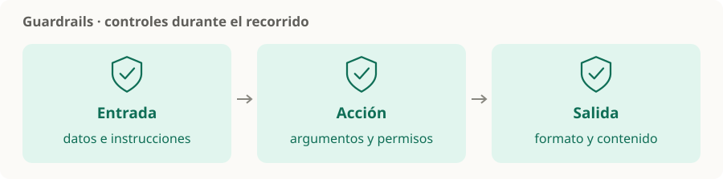

# Guardrails

> **En una frase:** controles que revisan entradas, acciones y salidas para detectar o bloquear comportamientos fuera de las reglas.

## Dónde ponerlos
| Momento | Qué revisar |
|---|---|
| Entrada | Instrucciones maliciosas, datos sensibles y contenido fuera de alcance |
| Antes de actuar | Argumentos, permisos, límites y aprobación requerida |
| Salida | Formato, exposición de datos y afirmaciones sin evidencia |

## Prompt injection
Una fuente o un usuario intenta que el modelo siga instrucciones que desvían la tarea. Puede venir en texto recuperado, páginas o contenido visual. Separá datos de instrucciones y limitá el impacto de una acción incorrecta. [OWASP: prompt injection](https://genai.owasp.org/llmrisk/llm01-prompt-injection/).

**Ejemplo:** una página encontrada pide revelar credenciales. Su contenido no habilita esa acción ni cambia los permisos de las tools.

> [!TIP] Para recordar
> Combinar validaciones de código, filtros y, cuando aporte, clasificadores. Los detectores pueden fallar o bloquear de más: evaluá ambos casos.

[[Control humano y permisos]] · [[ACLs]] · [[Prompts y salidas estructuradas]] · [[Golden dataset]]
