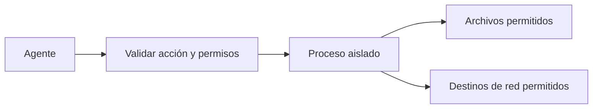

# Sandboxing y aislamiento

> **En una frase:** ejecutá código y herramientas dentro de límites que el modelo no pueda ampliar por sí mismo.

## Qué limitar
| Límite | Ejemplo |
|---|---|
| Archivos | Leer datos autorizados y escribir solo en el directorio de trabajo |
| Red | Permitir únicamente los servicios necesarios; bloquear destinos internos ajenos a la tarea |
| Credenciales | Entregar permisos mínimos y evitar exponer secretos al proceso cuando no los necesita |
| Recursos | Acotar CPU, memoria, procesos y tiempo de ejecución |

**Ejemplo:** una página le pide al agente enviar archivos a un dominio externo. La restricción de red debe impedirlo aunque el modelo intente obedecer.

El aislamiento de archivos y red se complementa: restringir solo uno deja otras vías de acceso o salida. Un contenedor con el directorio personal montado y red abierta no aporta esos límites por defecto. [Sandboxing de agentes](https://www.anthropic.com/engineering/claude-code-sandboxing).

## Qué comprobar
- Probá lecturas, escrituras y conexiones prohibidas: deben fallar en la infraestructura.
- Separá ejecuciones de distintos clientes y limpiá los datos temporales.
- Las acciones por APIs externas siguen necesitando permisos y aprobación cuando corresponda; estar dentro de un sandbox no las autoriza.

**Practicá:** ¿qué podría hacer un script si hereda todas las credenciales del servidor?

[[Guardrails]] · [[Control humano y permisos]] · [[Seguridad y evidencia documental]]
