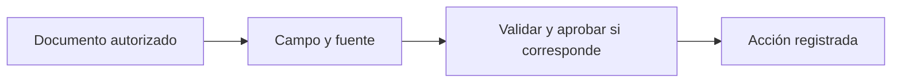

# Seguridad y evidencia documental

> **En una frase:** cada dato necesita evidencia y cada acción necesita autorización y registro.

## Tres ideas
- **Aislamiento:** aplicá el cliente y sus permisos a documentos, tools, cachés y trazas. Comprobá también intentos de acceso cruzado.
- **Evidencia:** conservá documento, versión y página por campo extraído. Medí corrección y completitud; un dato ausente debe quedar explícito.
- **Auditoría:** registrá quién autorizó, qué se intentó y qué ocurrió. Una traza técnica no reemplaza por sí sola un registro de auditoría protegido.

**Ejemplo:** una cotización cita el límite de cobertura de un PDF. El grader verifica monto, moneda y página; la tool comprueba permisos antes de guardarla.

> [!TIP] Para recordar
> Tener una cita no demuestra que el campo sea correcto: comprobá que la fuente respalde el valor.

## Practicá
> [!question]- ¿Cómo demostrarías de dónde salió un monto y quién autorizó la acción?
> Con dos registros enlazados. Para el monto: documento, versión y página de origen, el valor tal como aparece en la fuente, y el check que comprobó que la fuente respalda monto y moneda. Para la acción: quién la aprobó, cuándo y qué versión exacta aprobó (argumentos y monto), qué se ejecutó y qué devolvió el sistema externo, en un registro de auditoría protegido contra cambios. Si el monto cambió después de la aprobación, esa aprobación no lo cubre: [[Control humano y permisos]].

## Se conecta con
[[Normalization]] · [[RAG evals]] · [[Presupuesto de contexto]]
