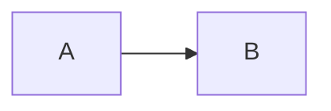

# {{title}}

> **En una frase:**

## Diagrama

```mermaid
flowchart LR
  A --> B
```

## Cuándo sí / cuándo no
| Usalo cuando | Evitalo cuando |
|---|---|
|  |  |

## Trade-offs
-

## Se conecta con
[[ ]]
